```{r setup, include=FALSE}
knitr::opts_chunk$set(echo = FALSE, warning = FALSE, message = FALSE)
Sys.setlocale("LC_ALL", "French")
source(here::here("assets", "settings", "custom.R"))
source(here::here("fondements-empiriques", "sim_data.R"))
source(here::here("fondements-empiriques", "pre-post-example.R"))
library(dagitty)
library(ggdag)
library(papaja)
library(here)
library(kableExtra)
```

# Introduction {.unnumbered}

Ce document offre un survol des fondements empiriques de la méthode expérimentale appliqués à la recherche en technologie éducative. D'abord, les différentes sources de connaissance issues de la recherche empirique -- observations, simulations et expériences -- sont brièvement comparées. Le document s'intéresse ensuite aux expériences, en identifiant quatre étapes principales dans un processus de recherche expérimentale: la justification, l'explication causale potentielle, le processus génératif des données, et l'inférence. Chaque étape sera illustrée à l'aide de concepts et exemples. En guise de conclusion, la méthode expérimentale sera analysée en fonction de ses avantages et désavantages épistémologiques.

Ce document est destiné à des étudiant-es sans une expérience préalable en recherche expérimentale. Il s'intéresse principalement aux fondements empiriques de la méthode expérimentale, c'est-à-dire la logique épistémologique qui confère aux expériences la capacité -- sous certaines conditions et lorsque plusieurs expériences sont cumulées -- d'évaluer/expliquer l'effet d'une intervention sur un phénomène d'intérêt.

Le document est complété par trois autres ressources:

-   Fondements statistiques de la méthode expérimentale

-   Lire et interpréter des contributions expérimentales *primaires*

-   Introduction au pré-enregistrement d'une recherche expérimentale

# Sources de la connaissance empirique

Les connaissances empiriques sont basées sur trois sources:

1.  **Les observations**\
    La « réalité » est observée de manière plutôt passive, en exploitant des phénomènes qui se manifestent spontanément
2.  **Les simulations**\
    La « réalité » est (re)construite à travers des mécanismes computationnels qui illustrent l'évolution d'un phénomène
3.  **Les expériences**\
    La « réalité » est sollicitée par une intervention active, pondérée et planifiée, dont l'effet est évalué sur un phénomène d'intérêt

Il y a eu dans le passé la tendance à séparer nettement les trois sources, notamment au niveau de la distinction entre observations et expériences selon le principe "*correlation is not causation"*. Dans ce sens, les expériences sont identifiées comme le *golden standard* pour établir des mécanismes causales. Plus récemment, il y a la tendance à voir la causalité comme un effet émergent qui peut être établi également lorsque l'intervention n'est pas effectuée de manière active, mais inférer depuis des situations qui répondent à des critères spécifiques [@pearl2000; @pearlCausalInferenceStatistics2016; @pearl2018book; @rohrer2018].

De plus, il existe des recouvrements entre les trois sources qui sont souvent utilisées de manière complémentaires pour maximiser la connaissance qu'on peut avoir sur un sujet. Le reste de cette section s'intéresse néanmoins aux expériences de manière plutôt *classique* [@maxwell2017], afin de fournir un aperçu conceptuel qui peut être ensuite décliné dans des *formats hybrides* plus complexes.

# Les étapes d'une expérience

Une expérience est un écosystème complexe d'éléments qui doivent coexister et s'influence mutuellement. On peut identifier 4 étapes principales dans une expérience:

1.  La **justification** qui consiste à établir la *raison d'être* d'une intervention active pour en étudier l'effet sur un ou plusieurs phénomènes d'intérêt

2.  L'**explication causale potentielle** qui consiste à émettre des hypothèses --avec différents niveaux de précision possibles -- sur le mécanisme causale qui détermine/explique l'effet de l'intervention

3.  Le **processus génératif de données** qui consiste à créer un micro-monde dans lequel l'intervention puisse être menée dans des conditions qui visent à exclure, idéalement, toute autre source de variabilité potentielle

4.  L'**inférence** qui combine des outils statistiques et des connaissances dans le domaine pour déterminer à quel point le processus génératif de données (le micro-monde) fourni des éléments utiles et fiables qu'on peut généraliser au contexte plus large (le macro-monde/la réalité)

L'image suivante illustre le 4 étapes en signalant la présence de *rétro-feedback* depuis la dernière étape de l'inférence aux étapes précédentes. En effet, après l'étape d'inférence les étapes précédentes sont réévaluées de manière critique suite à l'inférence qui est tirée depuis les résultats de l'expérience.

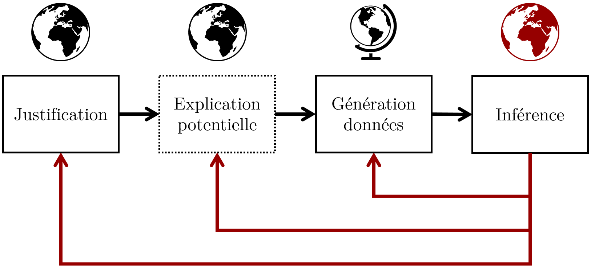{width="80%"}

# Justification

Les expériences impliquent une forme d'action -- l'intervention -- qui est susceptible d'avoir un effet sur la réalité à travers au moins un phénomène identifiable:

-   Par **intervention**, on se réfère de manière très flexible à une action qui modifie la « réalité », y compris de manière épistémique (i.e. ce que l'on sait sur un sujet). L'action peut être concrète et appliquée (e.g. introduire une technologie en salle de classe, proposer un scénario pédagogique innovant, mettre à jour une interface utilisateur, ...) ou plus abstraite et théorique (e.g. un principe ou une théorie pédagogique, un référentiel de compétences, un plan d'études, ...).

-   Par **phénomène**, on se réfère de manière très fléxible à un pattern d'événements qui se répète de manière congruente, par exemple dans des conditions similaires. Le pattern peut être concret et appliqué (e.g. la rétention mnésique d'éléments dans une liste, la perception d'utilité d'un artefact technologique, ...) ou plus abstrait et théorique (e.g. la compréhension de texte, la collaboration, le bien-être des étudiant-es, ...).

De ce fait, les expériences doivent être planifiées et pondérées attentivement selon au moins deux principes phares:

-   Quel serait le bénéfice à appliquer l'intervention, comparé à ne pas l'appliquer

-   Quel serait la perte potentielle à appliquer l'intervention, comparé à ne pas l'appliquer

Si on prend l'exemple de l'introduction d'une technologie éducative pendant un cours, les deux questions à se poser seront donc (1) qu'est-ce que les étudiant-es obtiennent *en plus* par l'introduction de la technologie ; et (2) qu'est-ce que les étudiant-es *risquent de perdre* à cause de l'introduction de la technologie. Les étudiant-es pourraient gagner en interactivité, collaboration, maîtrise technique, etc. ; et en même temps risquer de perdre en termes de temps nécessaire pour apprendre à utiliser la technologie, en charge cognitive pour articuler plusieurs environnements de travail, etc.

Dans le domaine de la recherche, en plus, l'introduction d'une intervention doit aussi respecter une double justification:

1.  **Scientifique**: est-ce que l'intervention est pertinente par rapport aux connaissances disponibles dans le domaine de référence ?

2.  **Éthique**: est-ce que l'intervention considère attentivement le rapport entre bénéfices et risques potentiels, notamment au niveau des participant-es ?

La combinaison entre les deux justifications jettent les bases pour une question de recherche à laquelle on peut essayer de répondre à travers une expérience.

## Justification scientifique

La justification scientifique est représentée dans les articles ou contributions scientifiques en général par l'introduction et le cadre théorique.

L'introduction illustre la problématique, sa pertinence par rapport aux connaissances actuelles ou phénomènes émergents. La problématique peut être abordée idéalement dans un espace défini par deux continuum:

1.  **Exploratoire vs. Confirmatoire\
    **Dans une expérience exploratoire, les connaissances actuelles sont jugées encore incomplètes ou trop fragiles/contradictoires pour formuler une explication causale potentielle précise (voir point suivant). L'objectif de l'expérience est principalement celui de mettre en relief des effets potentiels qui pourraient justifier l'intérêt pour des recherches ultérieurs. Au contraire, les expériences confirmatoires cibles de manière précise une intervention, qui peut être aussi une théorie, avec l'objectif d'en corroborer la validité ou d'en remettre en question la pertinence (e.g. la rejeter). Ce mécanisme en technologie éducative -- et plus en général dans les sciences sociales -- est très complèxe, car les phénomènes sont souvent articulés [@meehlAppraisingAmendingTheories1990; @scheel2020].

2.  **Fondamentale vs. Appliquée\
    **La recherche fondamentale s'intéresse à la compréhension de phénomènes de manière transversale et indépendante à des applications concrètes, tandis que la recherche appliquée vise généralement un contexte et un cadre d'intervention plus spécifique. La distinction est néanmoins délicate et avec plusieurs recouvrements possibles. On peut retenir généralement l'intention de la recherche: est-ce qu'elle vise à apporter des contributions sur un large domaine d'application ou plutôt sur un cadre plus restreint et spécifique ?

Le cadre théorique articule ce que la communauté scientifique connait (ou ne connait pas encore) à propos d'un sujet et comment ces connaissances ont été acquises: observations, simulations, expériences, mais aussi raisonnement, argumentation, synthèse de connaissances actuelles avec des revues de la littérature ou méta-analyses. Le cadre théorique met en général en relief des manques ou évidences ambivalentes qui justifient la nécessité de proposer une nouvelle expérience ou de répliquer une expérience déjà menée afin de *contrôler* la fiabilité et robustesse des résultats.

La justification scientifique dépend des connaissances du domaine ou des domaines spécifiques desquels l'intervention s'inspire et/ou dans lesquels elle s'applique.

## Justification éthique

La justification éthique considère l'ensemble des implications internes et externes à l'expérience, surtout d'un point de vue des entités impliquées (e.g. les participant-es, les écoles, ...). Outre à la sensibilité des données recueillies qui est partagée aussi avec les études de type observation, les expériences sont caractérisées par une intervention active, décidée en amont par les chercheurs, qui peut par exemple être appliquée seulement à une partie des participant-es. Il faut donc pondérer à quel point l'intervention peut produire des effets *objectivement* ou *subjectivement* négatifs pour les participant-es.

De plus, les implications éthiques ne concernent pas seulement ce qui est fait, mais également ce qui n'est pas fait (et aurait pu être fait). Si on imagine une intervention techno-pédagogique qui est censée apporter des avantages énormes au groupe qui peut en bénéficier, est-il acceptable d'un point de vue éthique d'avoir un *groupe contrôle* sous forme d'une classe qui n'aura pas accès à cette technologie ?

Ce type de dilemmes étant très délicats, les expériences doivent être acceptées par une commission éthique, à laquelle les chercheurs doivent fournir toute information utile, comme le public cible, le type d'intervention envisagée, la présence d'éventuels mécanismes cachés aux participant-es, etc.

## Question de recherche expérimentale

La combinaison entre la justification scientifique (qu'est-ce qui est pertinent par rapport aux connaissances actuelles) et la justification éthique (qu'est-ce qui est raisonnable tester en respectant l'intégrité de toutes les parties prenantes) détermine la question de recherche expérimentale.

Comparé à une question de recherche scientifique au sens plus large, une question de recherche expérimentale se caractérise généralement par la prédisposition à identifier précisément l'intervention et le(s) phénomène(s) d'intérêt souvent déjà à partir du titre de la contribution ou de l'article scientifique. Ce mécanisme est d'ailleurs illustré par exemple dans ces sujets de mémoire du Master MALTT appliquant la méthode expérimentale:

-   *The influence of background music on learning from text* ([Adam, 2019](https://tecfa.unige.ch/tecfa/maltt/memoire/Adam2019.pdf))
-   Collaboration en environnement médiatisé par ordinateur: Des usages et de l'impact d'un outil de feedback émotionnel ([Perrier, 2017](https://tecfa.unige.ch/tecfa/maltt/memoire/Perrier2017.pdf))
-   Étude de l'effet de l'esthétique sur l'utilisabilité d'une interface lors d'une tâche de recherche d'informations sur un site Internet ([Venni, 2017](https://tecfa.unige.ch/tecfa/maltt/memoire/Venni2017.pdf))

La recherche expérimentale se traduit souvent par des formulations qui suggèrent -- avec différents degrés de *précaution* selon le caractère exploratoire ou confirmatoire vu plus haut -- des mécanismes causales potentiels entre l'intervention et l'évolution du phénomène d'intérêt.

# Explication causale potentielle

L'explication causale potentielle est la seule étape du processus qui n'est pas formellement indispensable à la méthode expérimentale. On peut tout à fait imaginer de mener des expériences dans lesquelles les chercheurs n'émettent pas d'hypothèses sur les mécanismes qui déterminent l'effet de l'intervention sur le phénomène d'intérêt. Cette utilisation non-explicative ou a-théorique s'applique notamment dans certaines type de test A/B utilisés en expérience utilisateur (est-ce que le bouton vert génère plus d'inscriptions du bouton bleu ?) ou dans les environnements productifs (le matériel A est plus résistent du matériel B). Cependant, même lorsqu'une hypothèse causale n'est pas formellement testée dans une expérience, l'expérience en elle-même est soutenue au moins par une réflexion de causalité potentielle (j'imagine que le bouton vert peut attirer d'avantage le regard, ou avoir une meilleure lisibilité, ou les deux en même temps). Si ce n'était pas le cas, alors on devrait tester indistinctement toutes les combinaisons potentielles entre éléments, avec des coûts et pertes de temps exorbitants.

## L'effet de *X* sur *Y*

La plupart des recherches qui adoptent la méthode expérimentale s'intéressent donc à des mécanismes causales potentiels qui pourraient expliquer l'effet de l'intervention *X* sur un phénomène *Y*.

$$
X \rightarrow Y
$$

D'un point de vue logique, on essaie d'établir une *fonction causale* selon laquelle le phénomène Y *écoute* l'intervention X pour déterminer son état. Nous avons donc une sorte de *fonction* similaire au principe de Input-Output en programmation:

$$Y = f(X)$$La fonction causale $f(X)$ correspond en général à un modèle mathématique/statistique [@pearlCausalInferenceStatistics2016; @pearl2000; @rodgersEpistemologyMathematicalStatistical2010; @maxwell2017], sujet qui sera traité dans les fondements statistiques de la méthode expérimentale. Pour l'instant, on peut retenir en termes logiques que l'état du phénomène Y (e.g. le résultat à un examen) est une *fonction* de l'intervention X (e.g. est-ce que l'étudiant-e a résumé ses notes sous forme de carte conceptuelle ou de résumé textuel ?). En d'autres termes, on peut s'attendre à un *pattern* dans la *distribution* du phénomène Y qui dépend/est fonction de l'intervention X. Par exemple: on s'attend à un effet de la modalité avec laquelle les notes d'un cours sont résumées (carte conceptuelle vs. résumé textuel) sur les notes obtenus à l'examen. Le *pattern* attendu consiste dans une distribution des notes obtenues par les étudiant-es ayant utilisé les cartes conceptuelles autour d'une moyenne plus élevée par rapport à la distribution des notes obtenues par les étudiant-es ayant utilisé le résumé textuel.

D'un point de vue logique, la fonction causale est simple à déclarer en termes formels. En revanche, dans la pratique, déterminer un effet causal dans un environnement complexe est très difficile.

## Causalité en technologie éducative

Le contexte de la technologie éducative est particulièrement sensible à cette complexité, car il regroupe plusieurs types d'interactions entre les technologies éducatives, les processus d'apprentissage, et des facteurs qui peuvent influencer les unes, les autres ou les deux en même temps. On peut néanmoins essayer de synthétiser la recherche en technologie éducative d'un point de vue causale comme l'investigation des effets des technologies éducatives sur les processus d'apprentissage, avec des facteurs qui peuvent intervenir dans cette relation causale, comme illustré dans l'image ci-dessous.

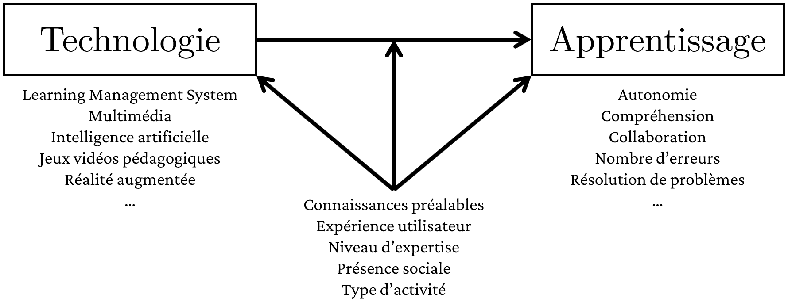{width="15.6cm"}

Du côté des technologies éducatives on peut trouver les *Learning Management Systems*, les principes multimédia, les jeux vidéos pédagogiques, etc. L'apprentissage peut être à son tour divisé dans des processus tels que la compréhension, la capacité a collaborer, la résolution de problèmes, etc. Parmi les facteurs qui peuvent intervenir dans cette relation figurent les connaissances préalables, l'expérience utilisateur dans l'appropriation et utilisation des technologies, le niveau d'expertise, et ainsi de suite.

La recherche expérimentale en technologie éducative consiste donc principalement à formuler des hypothèses sur les relations causales entre les technologie éducatives et les processus d'apprentissage, ainsi que sur les effets de facteurs qui peuvent faciliter, entraver, médier ou modérer ces effets.

## Difficulté à établir des relations causales

À l'intérieur d'un système complexe, dans lequel les relations entre concepts peuvent s'influencer mutuellement, réussir à détecter un mécanisme causal qui détermine la direction d'un effet (i.e. c'est l'intervention X qui détermine le phénomène Y) s'avère très difficile [@mackieCausesConditions1965; @pearl2000; @pearlCausalInferenceStatistics2016; @pearl2018book]. Il existe différents mécanismes qui peuvent rendre la détection d'une mécanisme de cause à effet compliquée. Cette liste, adaptée des travaux de Pearl [@pearl2000; @pearlCausalInferenceStatistics2016; @pearl2018book] -- voir aussi @mcelreathStatisticalRethinkingBayesian2020 -- en propose 4: un mécanisme de relation inverse, la présence d'une cause commune, la présence d'un médiateur, et la présence d'un effet de *collision*.

### Un mécanisme de relation inverse

Ce phénomène s'avère si on attribut un effet de X sur Y, lorsqu'en vérité c'est Y qui a un effet sur X.

$$X \leftarrow Y$$

On peut imaginer que l'utilisation de technologies de conception et fabrication assistées par ordinateur (CFAO) -- imprimantes 3D, broderie numérique, ... -- ont un effet sur la créativité des étudiant-es, mais il peut également être le cas que des étudiant-es avec à la base une créativité plus prononcée s'intéressent davantage à ce type de technologies.

### La présence d'une cause commune

Ce phénomène s'avère si on attribut un effet de X sur Y, lorsqu'en vérité X et Y n'est sont pas en relation causale, mais l'illusion d'un effet émerge à cause de la présence d'un troisième facteur qui influence à la fois X et Y.

$$X \leftarrow Z \rightarrow Y$$

Par exemple, le fait qu'un-e étudiant-e ait ou pas des stickers sur son ordinateur portable ($X$) n'a en soi aucun effet sur ses capacités en programmation ($Y$). Cependant, les programmateurs, qui ont donc des connaissances en programmation, ont souvent la tendance à mettre sur leurs propres ordinateurs des stickers des technologies ou langages de programmation adoptés ($Z$).

$$
Stickers \leftarrow Programmeur \rightarrow  Compétences
$$

Le fait d'avoir des stickers et d'avoir des compétences en programmation dérivent de la même cause: être programmeur. En revanche, si on ne considère pas cette cause commune et on se limite à observer que les étudiant-es avec les stickers ont des bonnes compétences en programmation, on pourrait faire l'hypothèse que les stickers ont un effet sur les connaissances en programmation (e.g. motivation, rappel, ...).

### La présence d'un médiateur

Ce phénomène s'avère quand X et Y sont vraiment dans une relation causale, mais le mécanisme est transmis à travers un troisième facteur Z. À ce moment, le risque est que l'effet causale entre X et Y peut disparaître si le facteur Z n'est pas représenté correctement.

$$X \rightarrow Z \rightarrow Y$$

Imaginons que les responsables d'une formation en technologie éducative se questionnent sur l'opportunité d'assigner aux étudiant-es des livrables intensifs d'un point de vue computationnel comme par exemple le montage vidéo, le rendering 3D, ou la modélisation de phénomène complexe avec des simulations Markov Chain Monte-Carlo ($X$). Ces livrables risque d'augmenter le temps de latence que les étudiant-es passe en attendant la fin des processus computationnels, ce qui les obligent à diminuer leur temps libre ($Y$). Cette relation est néanmoins médiée par la puissance des ordinateurs des étudiant-es ($Z$).

$$
Livrable \rightarrow Puissance \rightarrow Temps
$$

Or, si les responsables de la formation prenaient en considération dans un test/sondage/entretien seulement des étudiant-es avec des ordinateurs très performants, cette médiation pourrait donner l'illusion qu'il n'y a pas de mécanisme de cause à effet entre les livrables intensifs d'un point de vue computationnel et le temps libre des étudiant-es.

### La présence d'un effet de *collision*

Ce phénomène s'avère lorsque X et Y ne sont pas en relation causale, mais les deux influencent le même facteur. Il peut s'avérer que sous certaines conditions spécifiques de Z, X et Y résultent associés.

$$X \rightarrow Z \leftarrow Y$$

Imaginons que pour être accepté-es dans un Master ($Z$) il faut soit avoir suivi un bachelor ($X$) ou avoir une idée de projet pertinente avec le type de formation dispensée ($Y$). Les deux variables ne sont pas liées: on peut avoir une bonne idée avec ou sans bachelor, et on peut avoir un bachelor avec ou sans une bonne idée de projet.

$$
Bachelor \rightarrow Admission \leftarrow Projet
$$

Imaginons que les responsables du Master émettent l'hypothèse que l'obtention du bachelor détermine la qualité du projet proposé. Pour cela ils ne prennent en considération que les étudiant-es qui ont été admis-es. À ce moment, les responsables vont croire qu'il y a en réalité un effet. Lorsque deux phénomène sont indépendants, la probabilité que l'un **et** l'autre se manifestent est plus faible par rapport à la manifestation de l'un **ou** l'autre individuellement. Si l'étudiant-e a un Bachelor, il/elle est admis-e même sans un projet intéressant. Il y a donc plus de chances que les étudiant-es avec bachelor aient proposé un projet pas très intéressant. La même chose s'applique par reflet aux étudiant-es admis-es avec un projet intéressant: ils ont moins de chances d'avoir un bachelor. En combinant les deux choses, il semble émerger un effet négatif du bachelor sur la qualité du projet, mais qui est dû à la sélection seulement des étudiant-es admis-es.

## L'échelle de causalité

Dans ces travaux à propos de la causalité, Pearl [@pearl2000; @pearlCausalInferenceStatistics2016; @pearl2018book] propose d'imaginer une échelle avec trois marches nommées dans l'ordre depuis le bas de l'échelle **association**, **intervention**, et **contre-factuels**. Chaque marche qui est montée permet de s'approcher davantage à l'explication d'un mécanisme causale à travers des activités, questions et réponses potentielles différentes, comme illustré dans l'image ci-dessous.

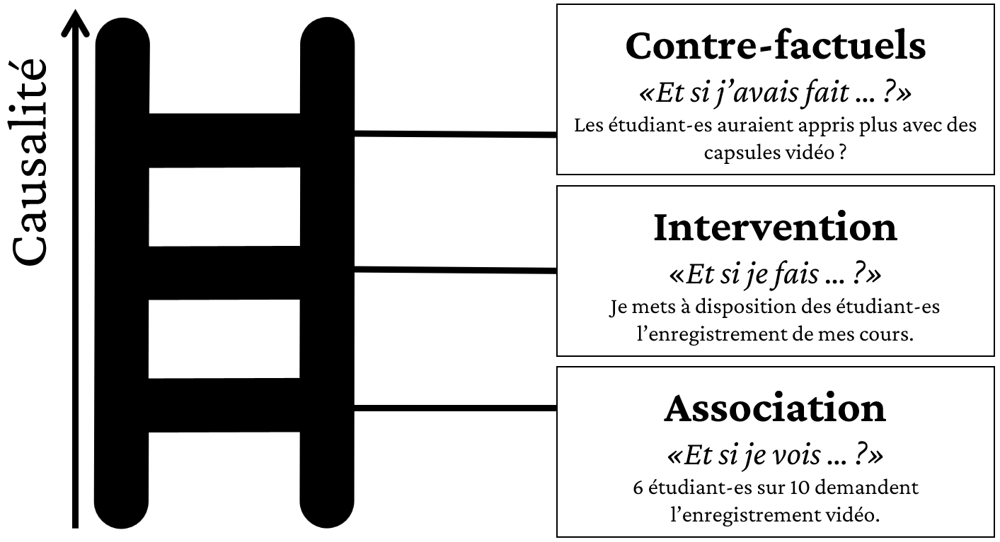{width="11cm"}

Nous proposons par la suite une description simplifiée des trois marches de l'échelle.

### Association

La première marche en bas de l'échelle consiste dans l'association de deux (ou plusieurs) phénomènes qui ont la tendance à se manifester selon des patterns récurrents. Comme indiqué plus haut dans la section consacrée aux difficultés dans l'établissement d'un mécanisme causale, une *simple* association ne permet cependant pas ni de déterminer si un phénomène est la cause de l'autre (ou vice-versa), ni d'exclure d'autres facteurs potentiels qui pourraient expliquer l'association (e.g. cause commune, médiateur ou effet de *collision*).

Une association peut être déterminée de manière systématique par exemple à travers un sondage, comme dans l'exemple de l'image: 6 étudiant-es sur 10 demandent l'enregistrement vidéo des cours. On peut inférer depuis cette information que les étudiant-es associent l'enregistrement vidéo du cours à quelques formes de bénéfices pour leur apprentissage.

Une autre manière de déterminer systématiquement une association consiste dans les études dites *corrélationnelles*, dans lesquelles le terme *association* est remplacé justement par le terme *corrélation* qui présente une connotation statistique précise. On peut en effet calculer la corrélation entre deux phénomènes mesurés quantitativement sur une échelle dans laquelle:

-   Un score s'approchant de -1 témoigne d'une corrélation *négative*, caractérisée par le fait que $X$ et $Y$ ont la tendance à varier de manière opposée: une valeur élevée de $X$ est associée à une faible valeur de $Y$ (et vice-versa) ; ou une valeur faible de $X$ est associée à une valeur élevée de $Y$ (et vice-versa).

-   Un score s'approchant de 0 témoigne l'absence d'une corrélation, c'est-à-dire que les deux phénomène ont la tendance à varier sans un pattern identifiable (e.g. si l'un est élevé, l'autre peut être parfois élevé aussi, parfois faible, et parfois moyen).

-   Un score s'approchant de 1 témoigne d'une corrélation *positive*, caractérisée par le fait que $X$ et $Y$ ont la tendance à varier de manière spéculaire: une valeur élevée de $X$ est associée à une valeur élevée de $Y$ (et vice-versa) et une faible valeur de $X$ est associée à une faible valeur de $Y$ (et vice-versa).

```{r correlations-examples, fig.height=3, fig.width=6, fig.cap="Exemple de corrélations"}
set.seed(3)
library(scales)
negative <- tibble(
  type = "Negative",
  x = 1:100,
  y = rescale((100 - x)  + rnorm(100, 0, 15), to = c(1, 100))
)

absence <- tibble(
  type = "Absence",
  x =  rescale(rnorm(100, 0, 15), to = c(1, 100)),
  y =  rescale(rnorm(100, 0, 15), to = c(1, 100))
)

positive <- tibble(
  type = "Positive",
  x = 1:100,
  y = rescale(x + rnorm(100, 0, 15), to = c(1, 100))
)

correlations <- bind_rows(negative, absence, positive) |> 
  mutate(
    type = factor(type, levels = c("Negative", "Absence", "Positive"))
  )

ggplot(correlations, aes(x = x, y = y)) +
  geom_point(color = "lightblue") +
  geom_smooth(formula = y ~ x, method = "lm", se = FALSE) +
  labs(x = "X", y = "Y") +
  facet_wrap(~type)

```

À ce stade stade, l'activité typique du chercheur est d'observer/regarder attentivement le contexte ou les phénomènes d'intérêt et se poser des questions telles que:

-   Que se passe-t-il si je vois/observe ... ?
-   De quelle manière les phénomènes sont-ils reliées ?
-   Comment voir $X$ permet de savoir quelques chose ou changer d'avis sur $Y$ ?

### Intervention

La deuxième marche de l'échelle concerne les intervenions. Une intervention est une action pondérée et planifiée qui est exécutée sur la réalité afin de produire un effet sur le phénomène d'intérêt. Contrairement à l'association qui peut être potentiellement *bi-directionnelle*, l'intervention vise à séparer ce qui relève du mécanisme causale (l'intervention $X$) et ce qui relève du phénomène causé/déterminé (le phénomène d'intérêt $Y$).

Comme indiqué plus haut, l'intervention peut-être interprétée de manière très flexible: elle peut concerner des aspects très spécifiques et localisés (e.g. la position d'une image dans un document de texte) ou des aspects plus généraux et holistiques (e.g. une théorie de l'apprentissage).

En reprenant les exemples dans l'image de l'échelle proposée plus haut, on peut imaginer qu'un-e enseignant-e décide de mettre à disposition des étudiant-es l'enregistrement de l'intégralité de ses cours. Cette intervention est une action, pondérée et planifiée, qui vise modifier la réalité, c'est-à-dire obtenir un effet d'intérêt -- dans ce cas, faciliter l'apprentissage des contenus du cours.

On peut imaginer que l'enseignant-e essaie d'évaluer l'effet de l'intervention en utilisant l'un des questionnaires standard d'évaluation des cours qui demandent aux étudiant-es de quantifier leurs connaissances avant et après le cours. On peut considérer en effet le cours comme une forme d'intervention.

```{r intervention-before-after, fig.height=2.5, fig.width=4, fig.cap="Données simulées sur les connaissances avant et après le cours (intervention). Les barres représentent des intervalles de confiance à 95%."}
before_after <- tibble(
  participant = paste0("P", 1:50),
  avant = rnorm(50, 3, 3),
  apres = avant + rnorm(50, 4, 2)
)

before_after |>
  pivot_longer(-participant, names_to = "quand", values_to = "evaluation") |>
  mutate(
    quand = factor(quand, levels = c("avant", "apres"), labels = c("Avant", "Après")),
    evaluation = round(rescale(evaluation, to = c(1,7)))
  ) |> 
  ggplot(aes(x = quand, y = evaluation, color = quand)) +
    geom_jitter(alpha = 0.2) +
    stat_summary(fun.data = mean_cl_normal, geom = "errorbar", width = 0.3, position = position_dodge(width = 0.1)) +
  stat_summary(fun = mean, geom = "point", size = 3, shape = 15, position = position_dodge(width = 0.6)) +
  labs(x = NULL, y = "Connaissances") +
  theme(legend.position = "none")
    
```

Les deux distributions de données suggèrent qu'il existe un effet entre avant et après. Cependant, il n'est pas possible de déterminer si cet effet est dû à l'intervention *mettre à disposition l'enregistrement des cours*. On ne peut en réalité pas distinguer l'intervention d'autres facteurs. Le gain de connaissance pourrait être dû au cours en général, mais également à d'autres cours dans la même formation. On ne peut paradoxalement même pas écarter la possibilité que l'effet aurait été plus grand si les enregistrements vidéos n'étaient pas à disposition. Les étudiant-es auraient pu perdre du temps à regarder l'intégralité des enregistrement au lieu d'utiliser ce temps pour faire d'autres activités plus propices à l'apprentissage.

L'intervention est l'élément centrale de la méthode expérimentale, mais elle n'est en soi pas suffisante pour établir un mécanisme de cause à effet. Cette marche de l'échelle est caractérisée par l'action planifiée et pondérée. Les questions qu'on peut se poser à ce stade sont par exemple:

-   Comment je peux obtenir $Y$ ?

-   Que se passe-t-il si je fais ... ?

-   Est-ce que si je modifie *X*, *Y* va être affecté par cette modification ?

### Contre-Factuels

La dernière marche de l'échelle, celle qui s'approche le plus à l'explication d'un mécanisme causale, concerne les contre-factuels. Les conte-factuels exploitent la capacité de la pensée humaine à imaginer des scénarios alternatifs à ceux qui se sont déroulés. La question commune aux contre-factuels est *que se serait-il passé si j'avais fait ... ?*

En maintenant l'exemple de l'enseignant-e qui met à disposition l'enregistrement vidéo de ses cours, des questions contre-factuels à se poser à la fin du cours pourraient être:

-   Qu'est-ce qui se serait passé si les étudiant-es n'avaient pas accès aux enregistrement du tout ?

-   Qu'est-ce qui se serait passé si les étudiant-es avaient accès à des capsules vidéos plutôt que à l'intégralité des enregistrement ?

On ne peut pas répondre à ces questions directement avec des faits, car les étudiant-es ont terminé leur cours avec l'enregistrement intégrale et donc on ne peut pas savoir comment *ces étudiant-es là* auraient réagi dans des conditions différentes. On pourrait donc imaginer de diviser les étudiant-es de la prochaine volée en trois groupes différents: (1) aucun accès à l'enregistrement vidéo ; (2) accès à l'intégralité de l'enregistrement ; (3) accès à des capsules vidéos. Cependant, cette expérience aurait les limitations suivantes:

1.  D'un point de vue éthique, cette répartition serait contraire au principe d'égalité de traitement des étudiant-es ;

2.  D'un point de vue scientifique, on ne pourrait pas généraliser les résultats obtenus dans le cours en dehors du cadre spécifique. Par exemple, il serait difficile d'évaluer des éléments comme: est-ce que le matériel du cours est bien fait ? Est-ce qu'il permet vraiment d'apprendre quelque chose ? Est-ce le système de notation de l'enseignant-e est fiable et objectif ? Etc.

Ce qui serait utile à cet effet serait plutôt un *principe* qui nous indique si et sous quelles conditions les capsules vidéos sont plus propices à l'apprentissage par rapport à un enregistrement vidéos d'un cours ex-cathedra ou à pas de vidéos de support du tout. Pour obtenir ce type de principe, une manière de procéder est celle de mener une expérience *idéalisée* qui soit (1) représentative de la problématique qu'on veut aborder, et (2) présente des éléments *prototypiques* qui puissent être généralisés à un maximum de situations similaires.

La question contre-factuel à laquelle ce type d'expérience essaie de répondre peut se synthétiser de la manière suivante: est-ce que **la même** personne bénéficie davantage d'une intervention plutôt que d'une autre par rapport au phénomène d'intérêt ? Ou est-ce que les interventions peuvent être jugées équivalentes, dans le sens ou le phénomène d'intérêt se manifesterait *exactement* de la même manière -- ou avec des différences négligeables -- sur **la même** personne, indépendamment du type d'intervention qu'elle aurait reçue ?

À ce stade de l'échelle de causalité, donc, les activités impliquées sont *imaginer*, *penser de manière rétrospective*, et *comprendre*. Les questions qu'on peut se poser à ce stade sont:

-   Que serait-il passé si j'avais fait différemment ?

-   Est-ce que c'est vraiment $X$ qui a causé $Y$ ?

-   Sans $X$, est-ce $Y$ se serait manifesté également ?

## Hypothèses théoriques et modèles structurels causaux

L'échelle de causalité permet de penser en termes d'effets et maximise donc la possibilité de pouvoir distinguer des mécanismes causales. Dans cette perspective, les chercheurs émettent souvent -- mais pas toujours -- des hypothèses théoriques/causales qui essayent d'expliquer pourquoi et comment l'intervention peut avoir un effet sur le phénomène. Il s'agit d'identifier des mécanismes, comme par exemple des principes, qui s'appliquent dans des conditions, idéalement les plus généralisées possibles, et qui permettent à l'effet de se manifester.

Dans l'exemple utilisé plus haut sur la mise à disposition des vidéos aux étudiant-es, on peut s'appuyer notamment sur des [principes de design multimédia applicables à la vidéo](https://edutechwiki.unige.ch/fr/Principes_de_design_multim%C3%A9dia_applicables_%C3%A0_la_vid%C3%A9o). Ces principes visent à maximiser l'efficacité de la vidéo comme instrument pédagogique en identifiant trois axes sur lesquels les caractéristiques de la vidéo peuvent agir:

1.  Gérer la charge cognitive
2.  Engager l'étudiant-e
3.  Faciliter la construction active des connaissances

Ces principes ont été dérivés empiriquement grâce à des expériences dans lesquelles des caractéristiques relatives aux trois axes ont été manipulées. Cependant, ces principes peuvent *fonctionner* à différents degrés (ou même ne pas fonctionner) selon certaines conditions ou caractéristiques des élèves. Par exemple, on n'engage pas de la même manière un-e étudiant-e novice sur un argument par rapport à un-e étudiant-e qui souhaite perfectionner ses connaissances déjà acquises.

Il existe donc différents éléments à prendre en ligne de compte pour tester si une intervention peut avoir l'effet souhaité. En effet, on peut identifier des conditions ou facteurs externes qui peuvent:

-   **Neutraliser l'effet de la vidéo sur les apprentissage**. Par exemple, si les étudiant-es n'ont pas le temps de regarder les vidéos chez eux, leur qualité intrinsèque n'aura aucun effet.

-   **Médier l'effet de la vidéo sur les apprentissage**. Comme on l'a vu plus haut, un effet de médiation s'avère lorsque une troisième variable se place entre l'intervention et le phénomène. Par exemple, on peut imaginer que la qualité de la connexion internet d'un-e étudiant-e joue un rôle très important dans l'exploitation des vidéos pédagogiques. Si la vidéo est interrompue ou de mauvaise qualité, ses effets sur les apprentissages seront mitigés indépendamment de la qualité intrinsèque de la vidéo.

-   **Modérer l'effet de la vidéo sur les apprentissage**. Un effet de modération s'avère lorsque l'effet de l'intervention sur un phénomène dépend de la valeur d'un autre phénomène (i.e. d'une autre variable). Par exemple, on peut imaginer que les étudiant-es plus en difficulté dans le cours peuvent bénéficier de manière plus conséquente de la présence des vidéos par rapport aux étudiant-es qui ont déjà bien compris les contenus du cours pendant les leçons synchrones. En termes concrets, on peut imaginer que la note d'une étudiant-e en difficulté puisse s'améliorer de 1 points (e.g. passer de 3 à 4) grâce à la vidéo, tandis que le gain pour un-e étudiant-e sans difficulté soit plus faible (e.g. passer de 5.25 à 5.5).

Une manière de prendre en considération les différents facteurs qui peuvent influencer l'effet d'une intervention sur un ou plusieurs phénomène d'intérêt consiste à utiliser un **Modèle Structurel Causal**, notamment sous la forme d'un ***Directed Acyclic Graphs*** (DAG), c'est-à-dire une représentation graphique de la relation entre variables appelée [@pearlCausalInferenceStatistics2016; @pearl2018book; @rohrer2018; @mcelreathStatisticalRethinkingBayesian2020]. Un DAG, représenté dans l'image ci-dessous, consiste dans une série de nœuds (les variables), reliés ou pas à travers des flèches directionnelles (les relations).

```{r example-dag}
#| fig.cap="General example of Direct Acyclic Graph (DAG)",
#| out.width="60%",
#| fig.align="center"
example_dag <- dagitty('dag {
bb="-4.44,-3.29,3.228,4.499"
A [adjusted,pos="-2,-1.5"]
B [pos="1.0,-1.5"]
C [pos="-0.5,1.5"]
F [pos="-0.5,-1.5"]
M [pos="-0.5,-0.5"]
X [exposure,pos="-2,0.5"]
Y [outcome,pos="1.0,0.5"]
A -> X
B -> Y
F -> X
F -> Y
M -> Y
X -> C
X -> M
X -> Y
Y -> C
}')
# drawdag(example_dag, lwd = 2, goodarrow = FALSE)
ggdag(example_dag) +
  theme_dag_blank()
```

Si deux variables sont liées par une flèche, cela signifie qu'on s'attend à ce que la variable vers laquelle pointe la flèche est une fonction de la variable depuis laquelle démarre la flèche:

$$
X \rightarrow Y \Longleftrightarrow f(X) = Y
$$

En d'autres termes, on s'attend à ce que la valeur de $Y$ soit **conditionnelle** à la valeur de $X$, car $X$ est une cause directe de $Y$. En termes formelles, cela peut être représenté ainsi:

$$
\mathbb{P}(Y|X) \neq \mathbb{P}(Y)
$$

En langage courant, cela s'interprète de la manière suivante: la probabilité (distribution) des valeurs de la variable $Y$ en sachant la valeur de la variable $X$ n'est pas la même que si on ne connaissait pas la valeur de $X$. Cela signifie, par exemple, que en sachant qu'un-e étudiant-e a passé beaucoup de temps à étudier pour un examen, on peut avoir une meilleure idée de la note obtenue par rapport à si l'information sur le temps passé à étudier n'était pas disponible.

Au contraire, si deux variables ne sont pas reliés par une flèche, cela signifie que leurs valeurs sont **indépendants**. En terme formels, cela se représente ainsi:

$$
\mathbb{P}({A}\space|\space{B}) = \mathbb{P}(A)
$$

Dans ce cas, même en sachant la valeur de la variable $B$, nous n'arrivons pas à en savoir davantage sur la probabilité d'obtenir une certaine valeur pour la variable $A$. Par exemple, même si on connaissait la taille d'un-e étudiant-e adulte, cela nous ne permettrait très probablement pas d'avoir une meilleure estimation de la note à un examen.

L'avantage d'un DAG consiste à combiner une représentation graphique intuitive des rapports entre variables avec des dérivations mathématiques axiomatiques qui permettent d'inférer les facteurs qui peuvent influencer le rapport entre deux variables d'intérêt. Dans l'exemple de DAG proposé plus haut, par exemple, on s'intéresse à l'effet direct de la variable $X$ sur la variable $Y$. Grâce à la structure spécifique du DAG en question, on peut par exemple savoir que les variables $A$, $F$, et $M$ influencent l'effet direct $X \rightarrow Y$. Au contraire, les variables $C$ et $B$ n'influencent pas cet effet direct.

Les potentialités et le fonctionnement d'un DAG dépasse le cadre introductif de ce cours. Mais il est important de savoir qu'un DAG peut contribuer énormément à savoir quel type de variable il est nécessaire de prendre en compte dans une expérience afin de pouvoir détecter l'effet d'une intervention sur un phénomène d'intérêt. En particulier, un DAG permet:

1.  De définir une hypothèse théorique/causale en termes explicites et non ambigus. Dans l'exemple du DAG on émet explicitement l'hypothèse que la variable $X$ détermine de manière causale la variable $Y$.
2.  De manifester les potentiels facteurs qui peuvent neutraliser, médier ou modérer cette relation causale. Ceci est très utile notamment pour savoir si on doit contrôler/ajuster empiriquement ou statistiquement pour certains variables afin d'éviter des potentiels facteurs parasites dans la chaîne causale qu'on veut tester. (Nous verrons plus bas la définition formelle d'un facteur parasite.)

Grâce à un DAG bien défini, les chercheurs se mettent dans une meilleure position pour créer le *micro-monde* dans lequel leur hypothèse théorique/causale peut être testée.

# Processus génératif des données

Le processus génératif des données est l'étape *concrète* d'une expérience. Jusqu'à maintenant, l'expérience a été d'abord justifiée d'un point de vue scientifique et éthique, et ensuite définie en termes de relations causales et hypothèses théoriques. En d'autres termes, pour l'instant l'expérience reste dans le domaine de l'imagé ou de l'idéalisé: selon les connaissances dont nous disposons et une chaîne de dérivations causales sur les relations entre une intervention et un phénomène d'intérêt, nous nous attendons à ce que l'intervention produit un certain effet.

À ce moment, il faut tester si ce raisonnement imagé et idéalisé peut se produire dans la réalité. Pour ce faire, les chercheurs créent un *micro-monde* dans lequel produire les **conditions nécessaires et suffisantes** à déclencher d'abord et mesurer ensuite l'effet de l'intervention sur le phénomène d'intérêt. Le *micro-monde* vise à trouver un équilibre entre la représentativité de la *réalité* d'une parte, et la réduction de la complexité nécessaire pour pouvoir isoler l'effet de l'intervention d'autres effets potentiels. La réduction de la compéxité ne concerne pas, en effet, seulement le fait qu'on a accès, souvent, seulement à un petit échantillon par rapport à la *population* de référence (e.g. les êtres humains en général, les étudiant-es en technologie éducative, les enseignant-es du primaire, etc.). La réduction consiste également des tâches définies ou simplifiées; des processus cognitifs, sociaux ou affectifs délimités; des interactions pré-établies; etc. Les choix concernant le *micro-monde* sont donc essentielles aux finalités de la recherche (validité interne), mais également à la possibilité de généraliser les résultats aux *macro-monde* (validité externe).

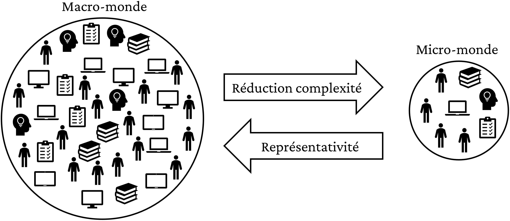{width="80%"}

Le rôle concret du *micro-monde* consiste dans la génération, la récolté et analysé des données empiriques. Le micro-monde est donc le résultat des choix épistémologiques et méthodologiques des chercheurs qui s'articulent principalement dans les éléments suivants:

1.  l'*opéralisation* des variables concernées;

2.  le design expérimental;

3.  les entités observées;

4.  la procédure et le matériel;

5.  l'analyse des données.

## Variables

La partie probablement la plus importante du processus de génération des données consiste dans le choix des variables. Ce sont les variables qui déterminent les caractéristiques des autres éléments du *micro-monde*. On identifie en général trois types de variables:

1.  La variable indépendante (VI)
2.  La variable dépendante (VD)
3.  La variable bloquée/neutralisée ou contrôlée/ajustée

Une expérience doit *à minima* proposer une variable indépendante et une variable dépendante. Le nombre totale de VI et VD et ensuite potentiellement infini, même s'il faut bien évidemment se heurter à des critères de faisabilité de la recherche. Les variables bloquées/neutralisées ou contrôlées/ajustées sont par contre optionnelles et souvent présentes de manière implicite, par exemple à travers la sélection des participantes selon des critères spécifiques. La distinction entre variable bloquée/neutralisée et contrôlée/ajustée n'est parfois pas explicitée ou est traitée de manière différente selon les manuels de méthode. Au contraire, la VI et la VD sont toujours traitées.

### Variable indépendante: l'*explenans*

Dans le *micro-monde* expérimental, la variable indépendante (**VI**) représente l'intervention dont on souhaite évaluer l'effet. Contrairement à la phase de justification et de l'explication causale potentielle dans lesquelles l'intervention est traitée de manière abstraite ou en forme de *principe*, dans le *micro-monde* la VI est **opérationnalisée**. Ce terme, très cher surtout aux psychologues, est parfois considéré de manière négative car retenu par certains une vestige de la période positiviste dans les sciences [@godfrey-smithTheoryRealityIntroduction2003; @meehlPhilosophyScienceHelp2006]. Ce qu'il faut retenir de ce terme est tout simplement que l'intervention est implémentée concrètement dans un format qui permet de la manifester dans le *micro-monde* expérimental.

La variable est dite indépendante car sa valeur n'est pas contrainte par autre chose si ce n'est le choix des chercheurs. En d'autres termes, les chercheurs peuvent manipuler de manière indépendante les valeurs de cette variable, sans avoir à se soumettre à des contraintes extérieures, si ce n'est au niveau de la justification éthique. À travers la manipulation, les chercheurs essaient d'expliquer l'effet de la VI sur la VD. Pour cette raison, la VI est aussi appelée ***explenans***, du latin: *ce qui explique*.

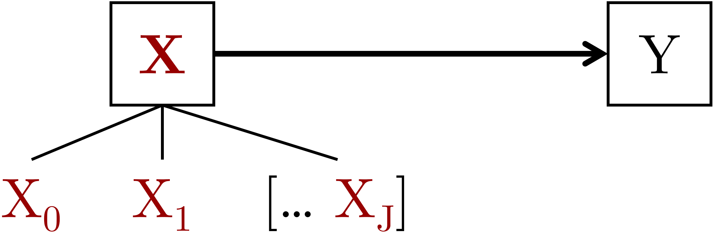{width="60%"}

Même s'il serait potentiellement possible de manipuler une variable sur un nombre de valeurs très large (e.g. faire étudier une personne 1 seconds, une autre personne 2 second, ... etc.), cela n'est pas imaginable d'un point de vue pratique. Pour cette raison, une variable indépendante assume généralement un nombre limité de valeurs qui sont dites **modalités ou niveaux de la VI**. Le nombre minimal de modalités/niveaux est de 2, ce qui permet notamment de comparer deux interventions potentielles, comme dans le cas célèbre des essais **contrôle/treatement** utilisés en médecine ou psychologie clinique. Dans ce type d'expérience, on compare deux groupes qui varient sur une seule variable indépendante: un groupe $X_1$ est sujet au traitement clinique, tandis que l'autre groupe $X_0$ ne l'est pas et représente donc le groupe contrôle ou groupe de référence.

Lorsqu'on implémente deux ou plusieurs VIs on à faire à un design dit **factoriel**, car le plan implique l'étude de l'effet de différents facteurs chacun avec au moins deux modalités/niveaux différents. Un plan factoriel très célèbre est le plan 2x2, dans lequel on étudie l'effet de deux VIs chacune avec deux modalités/niveaux. Le croisement des quatre modalités/niveaux crée ce plan 2x2 avec 4 **conditions expérimentales** différentes. Par exemple, les chercheurs peuvent manipuler simultanément: VI1 = support de lecture, avec modalités (a) Livre papier ou (b) E-book; et VI2 = difficulté du texte, avec modalités (a) Facile ou (b) Difficile. À ce moment, on obtient quatre conditions expérimentales, représentées dans le tableau ci-dessous.

| Condition | Support de lecture | Difficulté du texte |
|-----------|--------------------|---------------------|
| 1         | Livre papier       | Facile              |
| 2         | Livre papier       | Difficile           |
| 3         | E-book             | Facile              |
| 4         | E-book             | Difficile           |

: Les quatre conditions d'un plan factoriel 2x2

### Variable dépendante: l'*explenandum*

Dans le *micro-monde* expérimental, la variable dépendante (**VD**) représente le phénomène d'intérêt qui est causé par la VI. Pour cette raison, la VD est aussi appelée ***explenandum***, du latin: *ce qu'on veut expliquer*.

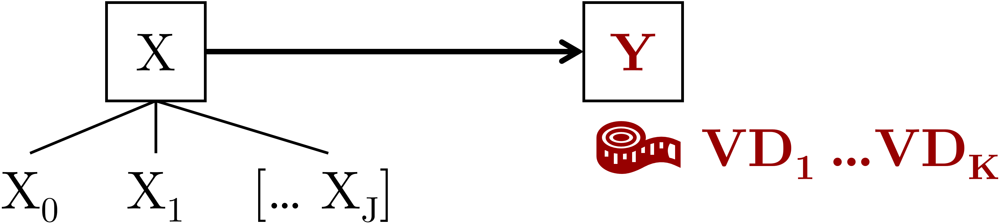{width="70%"}

Une expérience peut proposer une ou plusieurs VDs. Tout comme la VI, aussi la VD doit être opérationnalisée. Cependant, contrairement à la VI sur laquelle les chercheurs peuvent agir de manière indépendante, la VD est déterminée par le déroulement de l'expérience. En d'autres termes, la VD est la mesure du phénomène suite au déclenchement de celui-ci par la VI. Pour cette raison elle est dite **dépendante**. Ce terme possède une double perspective:

1.  La variable est dépendante du déroulement de l'expérience, donc en dehors de la possibilité de manipulation du chercheur une fois qu'elle a été opérationnalisée
2.  La variable est dépendante de la VI, car dans la plupart des cas on s'attend à une distribution de la VD qui est conditionnelle à la VI. En termes formels, comme indiqué plus haut, on pose donc l'hypothèse que $\mathbb{P}({VD}\space|\space{VI}) \neq \mathbb{P}({VD})$. On verra plus bas qu'on peut également poser l'hypothèse contraire, c'est-à-dire qu'il n'y a pas d'effet de la VI sur la VD, et donc que la VD est indépendante de la VI. Malheureusement dans la littérature sur la méthode expérimentale les termes se croisent souvent et il faut faire attention à bien comprendre le mécanisme plus que mémoriser les termes.

Pour que la VD soit représentative du phénomène d'intérêt, elle doit respecter trois critères fondamentaux.

**La sensibilité.** Elle concerne la capacité de la VD à discriminer des valeurs différentes sur l'échelle. Par exemple, un test sur la pensée computationnelle dans lequel tout le monde obtient le maximum (effet plafond) ou le minimum (effet plancher) des points possibles ne serait pas sensible. La sensibilité est donc étroitement liée au type de mesure choisi. On peut en effet avoir des mesures discrètes (qualitatives ou ordinales) ou des mesures continues [@williams2021]. Le type de mesure choisi détermine aussi la distribution qu'on peut s'attendre de la VD est, par reflet, aussi le type d'analyse statistique à mener.

**La fiabilité.** Elle concerne la stabilité de la mesure, c'est-à-dire la capacité de la VD a mesurer de la même manière deux mêmes instances du phénomène. Par exemple, si on utilise un chronomètre pour mesurer le temps nécessaire pour résoudre un problème, il faut que le chronomètre affiche exactement le même temps si deux personnes, ou la même personne dans deux situations différentes, nécessitent exactement du même temps pour la résolution du même problème.

**La validité.** Elle concerne la capacité de la VD a représenté vraiment le phénomène d'intérêt. Cet aspect est particulièrement compliqué lorsqu'on s'intéresse à des phénomènes qui sont difficiles, voire impossibles à observer directement. Par exemple, une déterminante importante dans l'apprentissage avec la technologie éducative est le *sentiment d'auto-efficacité*. Or, ce sentiment est subjectif et il n'y a donc pas manière de l'observer/mesurer depuis l'*extérieur*. Il faut l'inter-médiation de la personne elle-même qui doit, par exemple, évaluer le sentiment sur une série de questions à choix multiples. Or, il faut être sûr que ces questions permettent vraiment de mesurer le sentiment d'auto-efficacité et non pas un autre phénomène, comme la motivation à utiliser une technologie éducative. La validation d'une mesure nécessite donc un processus complexe et articulé, raison pour laquelle il existe dans la littérature des mesures dites **validées empiriquement** qui augmentent les chances de mesurer vraiment le phénomène d'intérêt [@flakeMeasurementSchmeasurementQuestionable2020].

La validité est la caractéristique d'une VD plus difficile à atteindre et aussi à évaluer. Il faut souvent la croiser avec d'autres sources d'informations pour s'assurer que la VD est vraiment représentative du phénomène d'intérêt. Il arrive souvent qu'on utilise à ce propos plusieurs VD ou une échelle avec plusieurs items sur le même concept théorique afin d'augmenter la validité d'une mesure. Mais cette pratique doit être effectuée de manière avertie, car la tentation est celle de garder seulement les mesures qui vont dans la direction de l'hypothèse et ne pas reporter les autres [@makelQuestionableOpenResearch2019; @johnMeasuringPrevalenceQuestionable2012].

### Variables bloquées/neutralisées ou contrôlées/ajustées

Dans le *micro-monde* expérimental, un enjeu principal consiste à créer les conditions nécessaires et suffisantes pour potentiellement créer l'effet de la VI sur la VD. Cela signifie que toute autre source potentielle d'influence sur la VD doit être de quelque sorte *désactivé*. Cette fonction est prise en charge par deux techniques: (1) la randomisation (traitée plus bas dans la partie sur le design expérimental), et (2) le blocage/neutralisation ou contrôle d'autres variables.

Comme nous l'avons vu plus haut avec l'introduction d'un modèle structural causal sous forme d'un DAG, il existe potentiellement un large nombre de facteurs qui peuvent jouer un rôle important dans la relation entre deux variables. En d'autres termes, il existe d'autres variables indépendantes potentielles en plus de celle ou celles qui sont en visées par les chercheurs de manière particulière dans une expérience.

Surtout en psychologie on utilise souvent cette formule pour définir ce concept: il faut déterminer l'effet de la VI sur la VD, *toutes choses étant égales par ailleurs*. En d'autres termes, pour s'assurer que c'est la variation sur la VI qui produit un effet sur la VD, il faut que toute autre source potentielle de variation soit *inhibée*. Pour ce faire, il existe principalement deux techniques.

**Bloquer/neutraliser une variable en amont.** Avec cette technique, les chercheurs décident de ne prendre en considération que les instances d'une seule valeur d'une autre variable. En d'autres termes, cette variable est *fixée* à une valeur spécifique. Par exemple, on peut imaginer que les compétences techniques préalables des étudiant-es jouent un rôle important sur leur sentiment d'auto-efficacité dans l'utilisation d'une technologie éducative. Lorsque les chercheurs s'intéressent à comparer deux technologies éducative différentes pour déterminer si l'une produit un meilleur sentiment d'auto-efficacité comparé à l'autre, les chercheurs peuvent décider d'obtenir une estimation plus fiable si seulement des étudiant-es avec des bonnes compétences techniques participent à l'expérience. De ce fait, la variable *compétence technique* est bloquée/neutralisé en amont de l'expérience par un filtre qui *laisse passer* seulement des participant-es qu'on peut juger équivalents au niveau de leurs compétences techniques préalables. Il en suit qu'il faut de quelque manière un mécanisme de *screening* sensible, fiable et valide (voir plus haut pour la VD) pour s'assurer que les participant-es puissent vraiment être considérées comme équivalents. Une autre technique de neutralisation/blocage d'une variable consiste à utiliser un nombre équivalent de participant-es sur une variable donnée. Par exemple, si on s'intéresse l'effet d'une technologie éducative introduite dans un Master commun entre Sciences de l'Éducation et Psychologie, mais on soupçonne que les étudiant-es vont réagir différemment à cette technologie selon leur background académique, on peut *filtrer* les participant-es pour avoir exactement le même nombre d'étudiant-es provenant d'un cursus ou de l'autre.

**Contrôler/ajuster une variable en aval.** Souvent il est néanmoins pas possible de *filtrer* par rapport à une autre variable en amont. C'est le cas, par exemple, d'une deuxième variable qui peut être déclenchée directement par l'expérience en elle-même, ou qu'on ne peut pas mesurer en amont sans dévoiler des informations sensibles au niveau des objectifs de la recherche. Imaginons que les chercheurs s'intéressent à l'efficacité de deux jeux vidéos pédagogiques sur le développement des compétences langagières des adolescents entre 14 et 16 ans. Or, les chercheurs veulent évaluer l'efficacité des deux jeux indépendamment de l'intérêt des adolescents pour les jeux vidéos. Ils ne peuvent donc pas insérer cette information dans l'affiche de recrutement, car cela risquerait d'attirer seulement des adolescents intéressé-es par les jeux vidéos. À ce moment, ces chercheurs peuvent faire recours à une technique statistique qui permet de contrôler/ajuster l'effet de la VI sur la VD par rapport aux valeurs d'une troisième variable (et potentiellement d'autres variables encore). Pour ce faire, cependant, ils doivent non seulement obtenir une mesure des compétences langagières (i.e. la VD), mais également de l'intérêt des participant-es pour les jeux vidéos.

## Design expérimental

Le design (ou plan) expérimental articule les relations entre la ou les variables indépendantes et la ou les variables dépendantes. Pour illustrer l'importance du plan expérimental d'un point de vue de l'explication causale potentielle, cette partie propose la comparaison entre trois types de plans ou designs:

1.  Le design non-expérimental
2.  Le design quasi-expérimental
3.  Le design expérimental *complet*

Ensuite, les variantes de design inter-sujets, intra-sujets ou mixte, ainsi que le design à mesure répétée seront également abordés brièvement.

### Design non-expérimental

Dans ce type de design, toutes les entités observées (e.g. les participant-es) sont exposés à la même intervention. En d'autres termes, ce comme si la variable indépendante n'avait qu'une seule et même modalité $X_1$. À ce moment, l'effet de l'intervention est mesurée sur une ou plusieurs variables dépendantes.

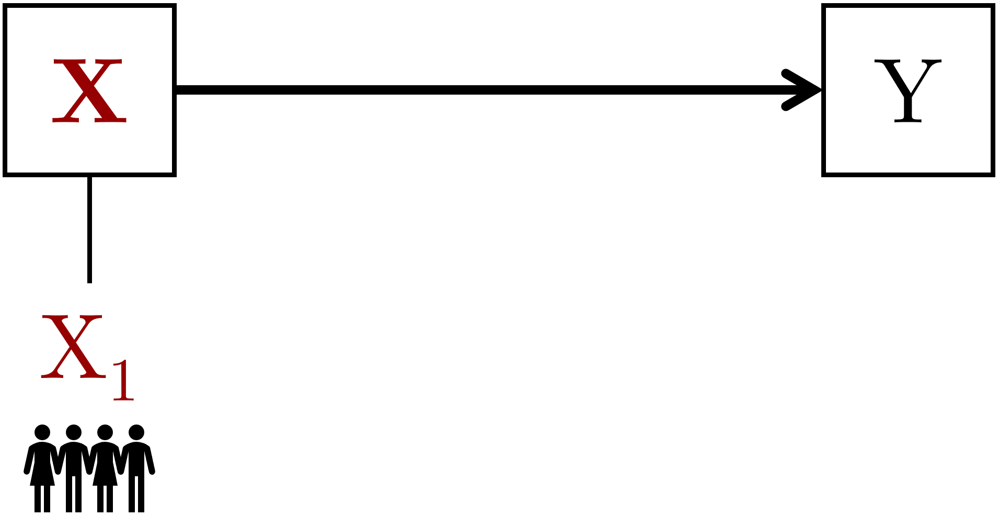{width="70%"}

Un exemple de design non-expérimental est représenté tout simplement par n'importe quel cours. L'intervention $X_1$ consiste à exposer les étudiant-es à des contenus et activités pédagogiques qui sont censées produire un effet sur les compétences et connaissances finales de l'étudiant-e. Pour des raisons d'équité, les étudiant-es participent d'une manière qui est jugée équivalente indépendamment de leurs caractéristiques. Même dans le cas de la pédagogie par projet, on évalue que les conditions des travaux (e.g. travaux par groupes) sont équivalentes pour l'ensemble des étudiant-es.

Comme il a déjà été brièvement abordé plus haut, lorsque tout-e étudiant-e est exposé-e exactement à la même intervention $X_1$, il n'est pas possible de déterminer si c'est cette intervention spécifique qui produit l'effet sur les apprentissages. En effet, les étudiant-es pourraient améliorer leurs connaissances et compétences grâce à un autre cours dans le même cursus qui traite de sujets similaires ou complémentaires. Paradoxalement, il n'est même pas possible d'écarter la possibilité que les compétences ou connaissances des étudiant-es seraient même majeurs sans l'intervention $X_1$. Il se peut que le cours freine l'apprentissage des étudiant-es par exemple en les privant de temps à consacrer à des activités pédagogiques plus propices ou en interférant avec les contenus ou activités d'autres cours.

### Design quasi-expérimental

Dans le design quasi-expérimental, il existe au moins deux modalités d'une VI, mais les entités/participant-es sont attribués à chaque modalité selon un critère pré-établi. Par exemple, deux classes d'une école peuvent être attribués à deux scénarios techno-pédagogiques différents, mais l'attribution de chaque élève au scénario est donc dépendant de son appartenance à la classe. De ce fait, il n'est pas possible d'exclure que les deux classes diffèrent sur d'autres facteurs qui pourraient expliquer, influencer, ou même masquer l'efficacité des deux scénarios pédagogiques sur le phénomène d'intérêt. Une classe pourrait en effet être plus avancée de l'autre dans le programme sur un sujet en relation avec les scénarios.

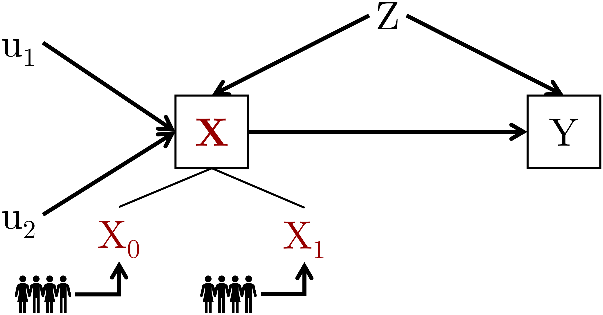{width="80%"}

Cette condition non-optimale est néanmoins parfois nécessaires, notamment lorsqu'il n'est pas possible d'attribuer aléatoirement les entités/participant-es à une modalité spécifique de la VI. À ce moment, il est souvent nécessaire de faire recours au contrôle/ajustement en aval des variables évoqué plus haut dans le texte. On pourrait en effet imaginer de faire passer un test de connaissance sur le sujet et utiliser ce score dans le modèle statistique pour tenir compte de cette source de variabilité extrinsèque aux scénarios techno-pédagogiques. Mais ce type de contrôle en aval nécessite d'une définition précise et non ambigüe d'un modèle structure causal comme illustré plus haut [@pearlCausalInferenceStatistics2016; @pearl2018book; @rohrer2018].

La situation quasi-expérimentale la plus difficile à gérer s'avère lorsque les entités/participant-es décident volontairement de s'attribuer à une modalité spécifique de la VI. Par exemple, on peut imaginer de laisser aux étudiant-es d'une classe le choix d'utiliser ou pas un logiciel de support à l'argumentation. À ce moment, le choix de s'auto-attribuer à la condition $X_0$ (sans logiciel) ou $X_1$ (avec logiciel) est très probablement dictée, au moins en partie, par l'intérêt ou les capacités préalables en argumentation de l'étudiant-e. De ce fait, même en présence d'une meilleure efficacité des étudiant-es en $X_1$ lors du test d'argumentation (VD), il ne sera pas possible de départager l'effet *induit* par le logiciel de l'effet *statique* dû aux caractéristiques des étudiant-es.

### Design expérimental *complet*

Dans le design expérimental *complet*, les entités/participant-es sont attribués aléatoirement aux modalités de la VI. L'attribution aléatoire présente l'avantage de bloquer, contrôler ou balancer tous les potentiels facteurs qui peuvent influencer la VI. De ce fait, on peut isoler seulement le lien entre la variable indépendante et la variable dépendante, c'est-à-dire le parcours $X \rightarrow Y$.

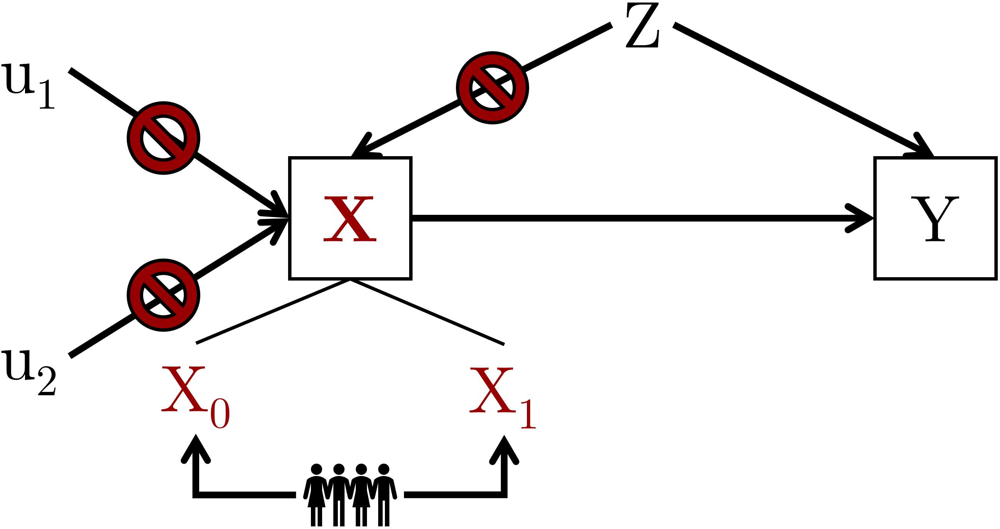{width="80%"}

L'introduction de l'attribution aléatoire permet également de formuler une définition précise et non ambiguë des variables parasites évoquées plus haut, celles qui nécessitent d'être bloquées/neutralisées ou contrôlées/ajustées. À ce propos, @pearl2000 propose l'introduction d'une notation explicite pour définir une intervention avec randomisation: l'opérateur $do(X)$. Avec cette nouvelle notation on peut donc différencier des interventions attribuées de manière pré-établie comme dans le design quasi-expérimental $\mathbb{P}({Y}\space|\space{X})$ des interventions avec attribution aléatoire de l'intervention $\mathbb{P}({Y}\space|\space{do(X)})$. Il en suit logiquement qu'on est en présence d'au moins une variable parasite lorsque:

$$
\mathbb{P}({Y}\space|\space{do(X)}) \neq \mathbb{P}({Y}\space|\space{X})
$$

Imaginons que des étudiant-es aient le choix entre disposer ou pas d'un logiciel qui les aident à planifier les travaux à rendre dans une formation basée sur la pédagogique par projet. La mesure d'intérêt consiste dans le sentiment d'être débordé-es par les rendus, avec l'objectif du logiciel de réduire ce sentiment. On pourrait à ce moment comparer deux interventions différentes: dans l'une, l'attribution à l'utilisation du logiciel est faite de manière aléatoire, dans l'autre, les participant-es peuvent choisir librement si utiliser ou pas le logiciel. Or, imaginons que les résultats produits sont les suivants:

-   Avec l'attribution aléatoire, l'efficacité du logiciel dans la diminution du sentiment de débordement est *pratiquement* équivalente entre le groupe avec logiciel et le groupe sans logiciel. En d'autres termes, le logiciel n'a pas un meilleur effet sur la réduction du sentiment de débordement.

-   Avec l'attribution volontaire, au contraire, le résultats montrent une meilleure efficacité du logiciel dans la réduction du sentiment de débordement. En d'autres termes, les participant-es qui ont choisi d'utiliser le logiciel reportent un mineur sentiment de débordement des participant-es qui n'ont pas choisi d'utiliser le logiciel.

Depuis cette comparaison on peut inférer la présence d'au moins une variable parasite, car le logiciel ne produit pas le même effet avec une attribution aléatoire ou une attribution volontaire. Il se peut que les participant-es ayant choisi d'utiliser le logiciel aient déjà en amont une meilleure prédisposition à l'organisation (il faut être organisé pour utiliser un logiciel d'organisation). En d'autres termes, on serait en présence d'une cause commune $Z$ qui, dans le design quasi-expérimental, aurait un effet à la fois sur le choix de l'intervention $X$ et sur les résultats de la VD $Y$. Au contraire, grâce à la randomisation, l'effet de $Z$ sur le choix de l'intervention serait bloqué/balancé. Il faut néanmoins noter que la randomisation n'a pas d'effet sur la relation entre $Z$ et $Y$. La variable $Z$ peut par exemple expliquer une partie de la variance dans la VD et il faudra donc prendre cette possibilité en ligne de compte (i.e. neutraliser/bloquer ou contrôler/ajuster) pour avoir une meilleure estimation de l'effet de $X$ sur $Y$ [@cinelliCrashCourseGood2020a; @pearlCausalInferenceStatistics2016; @maxwell2017].

On peut apprécier l'effet de la randomisation avec une simulation de données. Avec du code dans le langage R, 500 partipant-es ont été simulés avec les caractéristiques suivantes :

1.  Un âge aléatoire, tiré d'une distribution uniforme de 18 à 65 ans (chaque âge a la même probabilité d'être tiré)
2.  Un intérêt potentiel pour l'intervention $X_0$ sur une échelle de 1 à 7. La simulation donne plus de probabilité à des chiffres entre 2 et 4 pour cette variable.
3.  Un intérêt potentiel pour l'intervention $X_1$ sur la même échelle de la variable précédente, mais cette fois-ci la simulation donne plus de probabilité à des chiffres entre 4 et 7

```{r table-participants}
sim_data |>
  head(10) |> 
  custom_table(caption_text = "Aperçu des 10 premiers participants dans un jeu de données de 500", digits = 2)
```

En conséquence de cette simulation, les participantes ont la tendance ou prédisposition à privilégier l'intervention $X_1$ comparé à l'intervention $X_0$. À ce point, on peut simuler l'attribution de chaque participante à une modalité de la VI selon deux mécanismes :

-   Dans le premier mécanisme, les participant-es choisissent volontairement de *s'auto-attribuer* à la modalité $X_0$ ou $X_1$ selon leur propre prédisposition. En d'autres termes, si leur intérêt pour $X_0$ est majeur ou égale à l'intérêt pour $X_1$, alors les participant-es sont attribué-es à $X_0$. Si par contre leur intérêt est majeur pour $X_1$ comparé à $X_0$, alors les participant-es sont attribué-es à $X_1$.

-   Dans le deuxième mécanisme, chaque participant-e à exactement 50% de chances d'être attribué-e à $X_0$ ou $X_1$ indépendamment de sa prédisposition pour l'une ou pour l'autre modalité. Il s'agit en d'autres termes d'une attribution totalement aléatoire.

Le tableau suivant montre le nombre d'attributions ainsi que les moyennes et l'écart type des variables âge, interest_X0 et interest_X1 pour l'auto-attribution préférentielle des participant-es. On peut noter comme déjà il y a plus de participant-es qui ont choisi l'intervention $X_1$ et que la moyenne d'intérêt pour cette modalité est plus élevée par rapport à $X_0$.

```{r average-auto-attribution}
average_data_preference |> 
  custom_table(
    caption_text = "Répartition des variables avec auto-attribution préférentielle.", digits = 2
  )
```

Cet autre tableau montre les même résultats, mais lorsque l'attribution est faite avec le deuxième mécanisme totalement aléatoire. On peut remarquer que toutes les valeurs des variables sont plus proches les unes aux autres, notamment au niveau de la répartition de l'intérêt prédisposé pour les interventions $X_0$ et $X_1$.

```{r average-random}
average_data_random |> 
  custom_table(
    caption_text = "Répartition des variables avec attribution totalement aléatoire.", digits = 2
  )
```

Il en suit que, grâce à la randomisation, l'intérêt préalable pour les deux interventions est automatiquement balancé entre les deux modalités de la VI. Les deux groupes peuvent donc être considérés équivalents et on peut par conséquent être plus confiants qu'une éventuelle différence sur une VD serait induite par la manipulation expérimentale.

Cet exemple permet également d'aborder un autre argument relatif à la randomisation, c'est-à-dire qu'il existe différents techniques de randomisation.

**Randomisation avec remplacement**. L'exemple a utilisé une randomisation totalement aléatoire, aussi indiquée souvent comme une randomisation dans réplacement. Cette technique implique que à chaque nouvelle attribution d'une entité/participant-e à une modalité de la VI, chaque modalité à toujours la même possibilité d'être tirée. Il en suit qu'on peut avoir des variations plus au moins élevées au niveau du nombre total d'attributions, comme il a été le cas ici avec 269 attributions à $X_0$ et 231 à $X_1$. On peut en effet identifier plusieurs techniques de randomisation.

**Randomisation sans remplacement.** Au contraire, on aurait pu utiliser une technique qui établi en amont le nombre précis d'entités/participant-es à attribuer à chaque modalités de la VI. Par exemple, on aurait pu envisager d'attribuer exactement 250 participant-es pour chaque modalité. À ce moment, on utilise une technique qui randomise l'ordre d'attribution de 500 participant-es pour garantir l'équilibre. À ce moment, chaque fois qu'une modalité est attribuée, elle est effacée de la liste *sans être remplacée*. Par conséquent, le nombre de modalités à assigner diminue avec le nombre de participant-es. À la dernière attribution, le décompte sera donc forcément de 249 participant-es dans une modalité et 250 dans l'autre, et l'équilibre sera atteint justement avec cette dernière attribution.

**Randomisation bloquée avec ou sans remplacement**. Dans une randomisation bloquée, les entités/participant-es sont d'abord séparé-es par rapport à une caractéristique/variable spécifique, et seulement une fois cette séparation effectuée s'avère l'attribution aux modalités. L'attribution après la séparation peut se faire avec ou sans remplacement, même si dans la plupart des cas elle s'avère sans remplacement pour garantir notamment une répartition précise aux modalités. Mais même dans le cas d'une attribution avec remplacement, le *screening* en amont augmente la possibilité d'avoir une répartition plus équitable entre modalités. Par exemple, dans une expérience on peut s'intéresser à l'effet d'une intervention sur des apprennant-es novices ou experts dans un domaine. À ce moment, on veut s'assurer que les deux catégories sont représentées de manière équitable dans les différents modalités de la VI. Lorsque l'attribution est bloquée selon une caractéristique des entités/participant-es, on parle souvent de **variable indépendante invoquée**, en opposition donc avec une **variable indépendante provoquée** comme dans le cas de la manipulation expérimentale.

### Design inter-sujet, intra-sujet ou mixte

Une autre caractéristique importante du design expérimental concerne la manière précise dont les entités/participant-es sont attribué-es aux différentes VI et modalités des celles-ci. Il existe principalement trois types de design :

1.  Inter-sujets
2.  Intra-sujets
3.  Mixte inter-intra

**Design inter-sujets.** Dans ce type de design, les entités/participant-es sont assigné-es à des modalités de la VI différentes. Par exemple, dans le cas d'une seule VI avec deux modalités, moitié des participant-es sont attribué-es à la première modalité $X_0$ et l'autre moitié à la modalité $X_1$. Cela signifie que les participant-es $X_0$ ne sont exposé-es que à cette modalité et, idéalement, ne sont même pas à connaissance pendant l'expérience de l'existence d'une autre modalité. Cette information est en général dévoilée à la fin de l'étude pour éviter des biais. Par exemple, si on communiquait aux participant-es $X_0$ que dans la version $X_1$ les participant-es ont accès à une version plus récente d'un environnement techno-pédagogique, leur motivation et engagement pourraient diminuer simplement parce que les participant-es estiment avoir été placée dans une condition moins intéressante. Dans le design inter-sujet il est donc important de construire les groupes/conditions expérimentales afin de maximiser leur équivalence. Même avec l'utilisation de la randomisation, en effet, il peut y avoir des situations dans lesquels les attributions ne sont pas vraiment balancées, notamment avec un faible nombre de participant-es globalement.

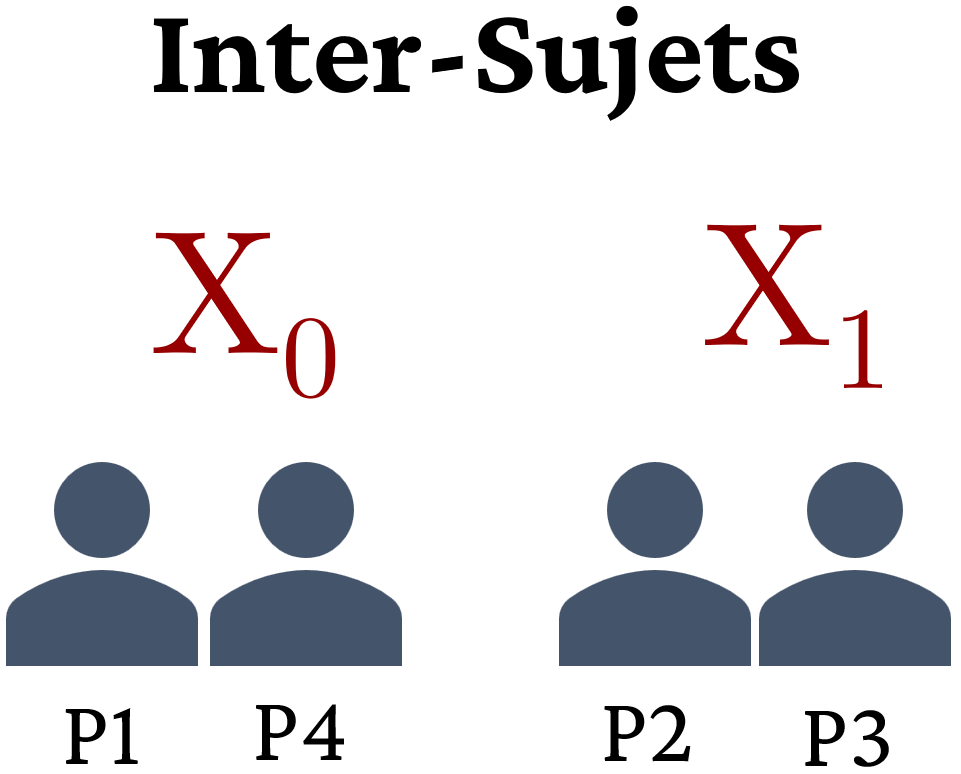{width="30%"}

**Design intra-sujets.** Dans ce type de design, chaque participant-e est exposé-e à toutes les conditions expérimentales. Dans le cas d'une seule VI avec trois modalités, par exemple, chaque participant-e sera exposé-e aux trois modalités, souvent dans une séquence différente pour éviter des effets d'ordre. Imaginons que l'expérience vise tester trois design graphiques différents d'un site web pédagogique. Si les participant-es testaient toujours les trois versions dans le même ordre, le dernier design pourrait bénéficier d'un effet de familiarité (on a la tendance à apprécier plus ce qu'on a déjà vu auparavant) ou, au contraire, être pénalisé par un effet de fatigue dû à l'exposition aux deux designs précédents. Le plan intra-sujet présente l'avantage de réduire la variabilité due à des facteurs externes aux VI, car les caractéristiques de la personne qui est exposée aux modalités sont exactement les mêmes. En revanche, le plan intra-sujet présente plus de risques au niveau des connaissances et de la compréhension des participant-es des objectifs expérimentaux. En effet, en ayant accès à l'ensemble du design expérimental, les participant-es peuvent plus facilement comprendre les objectifs de la recherche et risquent, même inconsciemment, de se conformer aux résultats attendus.

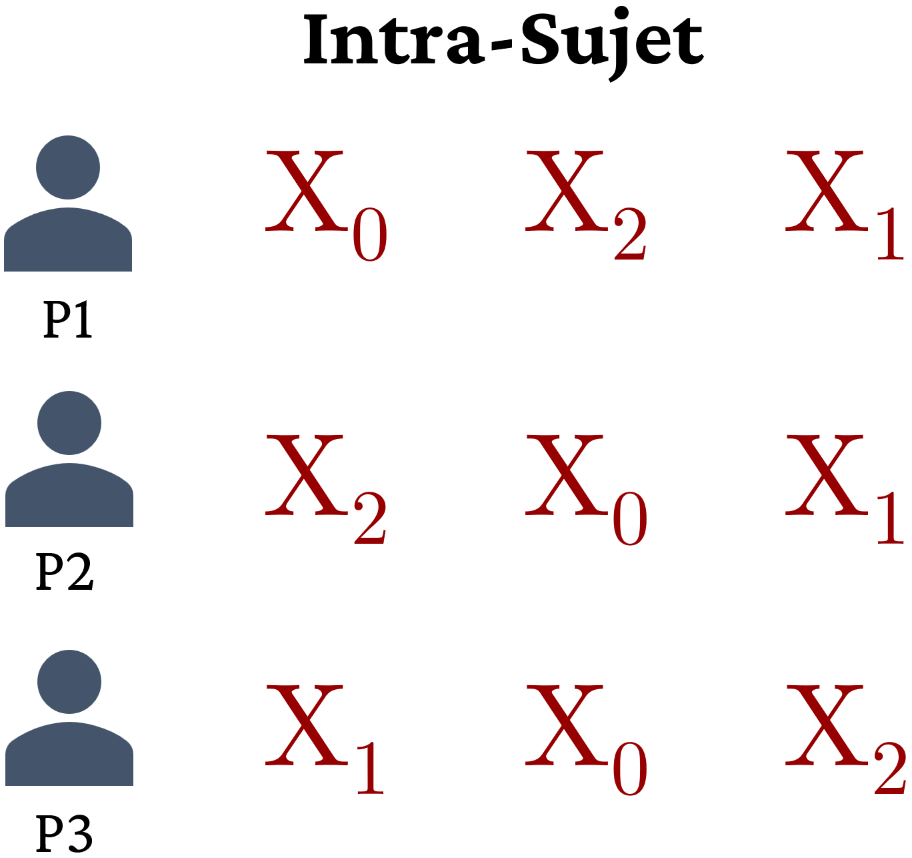{width="40%"}

**Design mixe inter-intra.** Ce type de design combine les deux types de design précédents. Pour mettre en place ce design, le plan expérimental doit prévoir au moins deux VI, car il est nécessaire qu'au moins une VI soit inter-sujets et au moins une VI soit intra-sujet. Par exemple, on peut imaginer un design expérimental avec une VI inter-sujet qui détermine si les participant-es allument ou pas leur caméra lors d'une tâche collaborative médiatisée par ordinateur. À l'intérieur de cette répartition inter-sujet, une VI intra-sujet expose les participant-es à une tâche collaborative facile et à une difficile. Moitié des participant-es commence avec la tâche facile et l'autre avec la tâche difficile pour éviter l'effet d'ordre. À ce moment, les deux groupes indépendants sur la VI de la webcam peuvent être comparés sur la différence intra-sujet entre la performance à la tâche facile et à celle difficile.

### Design expérimental à mesure répétée

Une variante du plan intra-sujet très répandue dans la recherche consiste dans un design expérimental à mesure répétée, également appelé design longitudinal. Dans ce design, le même type de mesure est récolté à différentes intervalles de temps sur les mêmes participant-es. Contrairement au plan intra-sujet décrit plus haut, dans lequel on mesure les participant-es à la suite d'une exposition à une modalité de la VI différente, dans le plan à mesure répétée la VI implicite est le temps qui passe. Par exemple, on peut mesurer la motivation des étudiant-es dans un cours au début du semestre et après chaque 2 semaines pendant un semestre universitaire. Dans ce cas, il n'y a pas une exposition à une différente modalité de la VI *explicite*. Le cours bien évidemment progresse, mais il n'y a aucune manipulation de la part des chercheurs qui vise, par exemple, à rendre les semaines entre 6 et 8 volontairement plus difficiles ou ennuyantes afin de voir si cela a un impact sur la motivation des étudiant-es.

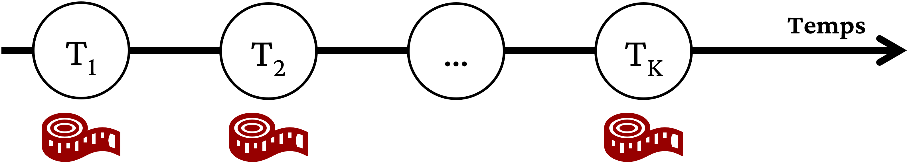{width="80%"}

Un design expérimental à mesure répétée très utilisé lorsqu'une expérience vise à déterminer un effet sur les apprentissages consiste dans le plan apellé **avant/après** ou **pré-test/post-test**. Dans ce type de plan, on fait une passation d'un premier test, par exemple sur les connaissances des participant-es sur un sujet, avant d'effectuer l'intervention. Le même test (ou une variante considérée équivalente) est administré après l'intervention. La comparaison porte à ce moment sur le gain d'apprentissage entre l'avant et l'après. Cette technique est souvent combinée avec une VI inter-sujet pour comparer si le gain d'apprentissage dans une modalité de la VI est supérieur à une autre ou aux autres modalités. Le graphique ci-dessous montre les résultats d'une expérience avec de design.

```{r pre-post-graph, fig.align="center", fig.cap="Exemple des résultats d'un plan inter-sujets avec pré-test et post-test", fig.height=3}
pre_post_plot
```

On peut noter comme les deux groupes $X_0$ et $X_1$ sont plutôt équivalente en pré-test, avec une moyenne autour de 100. Au contraire, dans le post-test la performance du groupe $X_1$ augmente de manière plus prononcée par rapport au groupe $X_0$. On parle à ce moment d'un effet d'interaction.

## Entités/Participant-es

Un autre élément important du *micro-monde* concerne les entités qui sont observées. Souvent, ces entités dans les sciences sociales -- et par extension en technologie éducative -- consiste dans des personnes/participant-es. Cependant, on peut avoir des observations au niveau des classes, ou on peut également étudier la performance d'artéfacts technologiques. Par exemple, on pourrait imaginer de lancer la même application web sur deux serveurs différents et récolter la vitesse de réponse sur chaque serveur pour voir si une machine est plus performante de l'autre. Dans le reste de cette partie, les entités seront néanmoins considérées en tant que participant-es. Ceci est non seulement plus représentatif de la réalité de la recherche en technologie éducative, mais requière aussi une attention plus prononcée sur les enjeux éthiques et sur la composition de l'échantillon.

Comme il a été indiqué dans la partie sur la justification éthique, la recherche menée avec la participations d'êtres humains est réglée par des lois (par exemple, en Suisse, la [Loi fédérale relative à la recherche sur l'être humain](https://www.fedlex.admin.ch/eli/cc/2013/617/fr)) et doit être soumise en amont à l'approbation d'une commission éthique. Les droits des participant-es s'expriment surtout -- mais pas exclusivement -- au niveau du *micro-monde* dans lequel la recherche aura lieu. Ce *micro-monde* peut être plus ou moins étendu, plus proche d'une expérience standardisé en *laboratoire* ou appliquée à un contexte écologique. Dans tous les cas, les actions demandées aux participant-es, ainsi que la manière dont les données sont récoltées, analysées et par la suite utilisées doit être bien communiquée aux participant-es.

Sur le plan de la composition de l'échantillon qui participe à la recherche, il y a au moins deux aspects qu'il faut considérer attentivement: (1) le nombre de participant-es, et (2) la modalité de recrutement et les critères de sélection. Ces deux aspects s'influencent mutuellement, car par exemple la difficulté à trouver des participant-es qui répondent à certaines critères de sélection peut contribuer à limiter le nombre de participant-es envisagés. Dans cette partie, les deux aspects sont néanmoins abordés de manière distincte pour faciliter l'exposition.

### Nombre de participant-es

Combien de participant-es sont nécessaires pour mener une recherche ? C'est l'une des questions les plus fréquentes qui sont posées au sujet de la recherche expérimentale. @lakens2022 identifie six approches différentes pour répondre à cette question :

1.  **Prendre en compte l'ensemble de la *population* de référence**. Même si cette option n'est pas très fréquente, il est possible qu'une expérience s'intéresse à une ensemble de personnes bien défini, sans la vocation de généraliser en dehors des participant-es à la recherche. Dans ce cas, la justification du nombre de participant-es ainsi que les critères de recrutement ou sélection sont déjà établi en amont.

2.  **Disponibilité des ressources**. Une recherche doit faire face à des limitations de temps, de ressources humaines et temporelles. On peut donc justifier le nombre de participant-es en termes de *faisabilité* pratique. Par exemple, les chercheurs ont à disposition un instrument de mesure partagé avec d'autres équipes seulement pour quelques semaines, ou ont réussi à obtenir des fonds pour payer correctement seulement un nombre spécifique de participantes.

3.  **Précision dans l'estimation d'un effet.** Les chercheurs veulent quantifier de manière précise les effets d'une intervention. Par exemple, des chercheurs peuvent s'intéresser à quantifier exactement combien de nouveau mots un-e élève de 7 ans peut apprendre sur une semaine selon que la classe utilise un livre papier ou un livre éléctronique. À ce moment, les chercheurs calculent le nombre de participant-es nécessaires pour attendre un degré de précision contenu dans des intervalles. Les plus étroites ces intervalles, le plus de participant-es sont nécessaires.

4.  **Analyse de puissance statistique *a priori***. Comme nous le verrons plus bas et encore plus précisément dans les ressources sur les fondements statistiques, la méthode expérimental s'appuie très souvent à des statistiques pour déterminer la présence, la direction, la magnitude et l'incertitude autour d'un effet. Il est possible d'utiliser une technique appelée *puissance statistique* pour déterminer combien de participant-es sont nécessaires pour détecter la présence ou décréter l'absence d'un effet selon sa taille. Plus petit l'effet cherché, plus grand la taille de l'échantillon.

5.  **Heuristiques**. Selon les domaines de référence, on peut avoir des *rules of thumb* qui suggèrent un nombre de participant-es préfixé. Par exemple, pour un certain temps en psychologie la règle été de 20 participant-es pour condition expérimentale. L'utilité et fiabilité de ces règles sont souvent mises en question par la communauté scientifique, mais elles peuvent néanmoins représenter une justification potentielle.

6.  **Pas de justification**. Il peut s'avérer aussi que les chercheurs ne disposent pas d'informations suffisantes pour s'exprimer sur le nombre de participant-es nécessaires. À ce moment, ils l'annoncent de manière transparente et honnête.

### Modalité de recrutement et critères sélection

Il existe à présent plusieurs possibilités pour mener une recherche expérimentale, notamment grâce aux plateformes de recrutement en ligne qui permettent non seulement d'avoir accès à un plus large nombre de personnes et de diminuer temps et coûts, mais également pour les possibilités de *screening* proposées. La décision sur les participant-es à prendre en compte pour une recherche peut être divisée en deux parties: (1) la modalité de recrutement, et (2) les critères de sélection. Encore une fois, les deux parties s'influencent mutuellement, car par exemple selon les profils des participant-es il se peut qu'un recrutement en ligne ne soit pas adapté (e.g. personnes avec peu d'expérience avec les applications web). Mais la distinction est utilisée pour faciliter l'exposition.

La modalité de recrutement définit les conditions dans lesquelles les participant-es rentrent en contact avec la recherche. Dans la plupart des cas, le recrutement est fait de manière volontaire, c'est-à-dire que les participant-es prennent connaissance de la recherche à travers un moyen de communication à large échelle, tel qu'une affiche dans le hall de l'université ou une annonce en ligne. Plus rarement, les participant-es sont visé-es spécifiquement par une modalité de contact, par exemple lorsque la personne appartient à une base de données à laquelle les chercheurs ont accès. À ce moment, le recrutement peut être fait sur l'ensemble des personnes visées par la recherche ou un échantillon généré aléatoirement.

Lorsqu'une recherche est menée dans une école, le recrutement se fait en amont et les participant-es sont donc définis en fonction par exemple à une classe ou un établissement qui a donné son accord de participer à la recherche. Dans ces situations, il faut faire une distinction entre la participation à la recherche et la participation à l'intervention pédagogique qui est menée dans les écoles. Toute personne doit être libre de donner son accord (ou pas) pour l'utilisation des données dans une recherche. À cet effet il faut donc créer la possibilité que des élèves/étudiant-es participent aux séquences pédagogiques comme partie obligatoire de la formation, mais peuvent refuser que leurs données soient utilisées pour la recherche.

Les critères de sélection déterminent les raisons pour lesquelles les participant-es sont retenu-es ou écarté-es à priori d'une recherche. Dans le passé, l'explication la plus fréquente des critères de sélection implique le concept de *représentativité* de l'échantillon de la *population* visée. Cette ressource partage l'avis d'autres chercheurs qui mettent en question l'utilité et l'adéquation du terme *population*. Plus que sur la représentativité d'un-e participant-e d'une hypothétique *population* avec des caractéristiques bien définies, cette contribution suggère de penser plutôt en termes de **processus de génération des données**. En d'autres termes, la sélection des participant-es n'est pas une activité qui est faite seulement pour des caractéristiques représentatives du participant (e.g. âge, sexe, profession, ...), mais implique l'interaction générale dans le *micro-monde* expérimental. Un-e participant-e est donc retenu-e pour la recherche en fonction de comment et pourquoi on veut générer les données expérimentales utiles à la recherche. Ce changement de perspective ne réfute certainement pas la nécessité d'appliquer des *filtres* pour garantir la qualité et la fiabilité des données générées à travers l'expérience. Au contraire, l'objectif est plutôt d'augmenter la transparence des critères de sélection qui ne peuvent plus se cacher derrière l'appartenance à un groupe de référence souvent très floue.

Ceci dit, des critères de sélections pour une recherche peuvent concerner :

-   Des limitations physiques des participant-es à effectuer des actions ou déceler certains stimuli. Par exemple une recherche qui s'intéresse à l'effet des couleurs sur la perception de la qualité du matériel pédagogique pourrait exclure a priori des participant-es présentant une forme de daltonisme, car leur perception des couleurs ne serait pas comparable aux autres participant-es.

-   Les connaissances ou compétences préalables dans un domaine ou sur un sujet. Surtout dans des expériences portant sur l'apprentissage, il est souvent nécessaire que les participant-es possède certaines connaissances ou compétences pour pouvoir comprendre le déroulement de la recherche.

-   Familiarité avec des artéfact technologiques ou pré-requis techniques. Les recherches en technologie éducative s'appuient souvent sur la manipulation directe de dispositifs technologiques, dont l'utilisation *de base* ou *avancée* peuvent être requises de la part des participant-es. Il peut également y avoir des critères très techniques, comme par exemple la résolution minimale de l'écran qui permet d'afficher l'ensemble d'une interface utilisateur.

D'autres aspects concernant la modalité de recrutement et les critères de sélection mériteraient d'être abordés, comme par exemple les biais relatifs à une participation volontaire ou à l'utilisation d'un échantillon de convenance. L'utilisation des plateformes en ligne pour mener une expérience est aussi un sujet qui nécessiterait un approfondissement sur les implications scientifiques et éthiques.

## Procédure et matériel

Tout ce qui se passe à l'intérieur du *micro-monde* doit être planifié et reporté attentivement par les chercheurs. La procédure et le matériel concernent en effet toutes les actions et tous les artéfacts (instruments de mesures, questionnaires, ...) qui sont censés permettre au *micro-monde* de générer, récolter et analyser des données d'intérêt. Cette activité de représentation fidèle de la réalité du *micro-monde* a une triple fonction :

1.  Pour les chercheurs eux-mêmes
2.  Pour les participant-es
3.  Pour la communauté scientifique

### Pour les chercheurs eux-mêmes

Les chercheurs doivent attentivement planifier les caractéristiques et le déroulement des interactions dans le *micro-monde* expérimental. Il s'agit en effet de la source des données qui leur permettent de répondre à la question de recherche et, plus largement, d'améliorer leur propre connaissance du domaine d'intérêt. En effet, à travers la planification d'une expérience on peut s'apercevoir d'éléments manquants ou découvrir des procédures et matériaux utilisés par d'autres contributions scientifiques qui portent sur le même sujet ou des sujets adjacents.

Afin de garantir une passation de l'expérience précise et uniforme entre participant-es, les chercheurs développent ce qu'on appelle un **protocole expérimental**. Ce protocole peut être plus ou moins standardisé, au point qu'il existe même des logiciels qui permettent aux chercheurs de structurer le protocole de manière détaillée et non ambiguë (e.g. [le site protocols.io](https://www.protocols.io/)).

Le protocole sert aux chercheurs pour déterminer trois aspects liés aux données qui s'influencent mutuellement : (1) la génération des données, (2) la récolte des données, et (3) l'analyse des données.

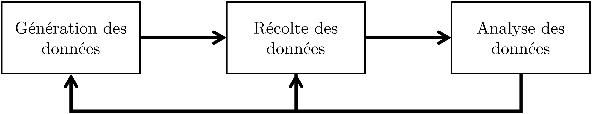{width="80%"}

**Génération des données.** La génération des données concernent toutes les éléments qui permettent aux conditions expérimentales (i.e. le VIs et leurs modalités) de s'exprimer concrètement et de produire, donc, les effets attendus sur les phénomènes d'intérêts (les VD). Les éléments qui ont généralement le plus d'impact sur la générations des données sont :

-   Les entités/participant-es déjà illustrés plus haut

-   Une activité ou tâche expérimentale que les participant-es doivent mener (e.g. tâche de résolution de problèmes, collaboration médiatisée par ordinateur, évaluation esthétique de matériel pédagogique, suivre une formation pendant un certain temps, etc.)

-   Les manipulations expérimentales qui permettent par exemple de cacher des informations aux participant-es (e.g. faire croire que les participant-es collaborent avec une personne tandis que c'est un script automatisé ou l'un des chercheurs) ou induire des situations d'intérêt pour les finalités de la recherche (e.g. produire de la confusion avec un texte reportant des informations contrastantes).

**Récolte des données.** La récolte des données concerne l'*enregistrement* du *micro-monde* dans un format quantitative et/ou qualitative qui permet ensuite l'analyse. Il existe en effet différents manières d'*encoder* la *réalité* produite par l'expérience. Parmi les chois relatifs à la récolte des données figurent:

-   Le format avec lequel les données sont représentées. Par exemple sous forme de réponses à un questionnaire papier/en ligne, à travers des mesures physiologiques, ou encore des enregistrement audio/vidéo d'une situation écologique (e.g. déroulement d'une séquence pédagogique).

-   Les instruments qui permettent la récolte des données. Par exemple un dispositif d'oculométrie qui permet de tracer le regard des participant-es, les manipulations sur une tablette effectuées par des élèves, ou encore logiciel qui permet de créer des sondages en ligne.

-   La situation et le contexte de récolte des données. Par exemple si l'expérience se déroulent en présence ou en ligne, si les participant-es effectuent l'expérience complètement en autonomie ou si le chercheur les accompagnent dans les étapes, si les participant-es passent l'expérience isolé-es ou en groupes (e.g. classes, groupes de travail, ...)

**Analyse des données.** L'analyse des données, traitées de manière plus approfondie plus bas dans cette section, concerne toutes les manipulations qui sont effectuées sur les données afin d'en tirer des informations utiles. Parmi les choix relatives à l'analyse des données figurent:

-   Les logiciels utilisés pour mener les analyses, car selon le type et/ou la version des logiciels les résultats peuvent présenter des différences

-   L'approche statistique envisagée par les chercheurs (e.g. *fréquentiste* ou Bayésienne)

-   Les représentations graphiques de support pour une meilleure compréhension des données à disposition

### Pour les participant-es

Le protocole expérimental détermine également ce qui est attendu par les participant-es. Il doit donc respecter les droits des participant-es en termes de participation à une recherche (i.e. justification/commission éthique).

Disposer d'un protocole expérimental détaillé permet également de s'assurer de dévoiler seulement les informations nécessaires et exactement au moment propice. En effet, dans la méthode expérimental il arrive souvent que les finalités de l'expérience et même des détails importants sont cachées aux participant-es. Avec un protocole expérimental, les chercheurs maximise les chances que les participant-es sont exposé-es exactement aux même informations dictées par exemple par la condition expérimental spécifique qui leur a été attribuée.

Du point de vue des participant-es, un protocole expérimentale prévoit en général les étapes prototypiques suivantes (qui s'adaptent évidemment au contexte de passation) :

1.  Accueil des participant-es et explication sur le déroulement de l'expérience

2.  Formulaire de consentement pour la participation à la recherche avec informations sur les droits des participant-es et sur l'engagement des chercheurs

3.  Opérations préliminaire à la tâche expérimentale (e.g. pré-test, découverte d'un environnement techno-pédagogique, ...)

4.  Tâche expérimentale. Cette étape peut concerner une passation relativement courte (20-30 minutes) ou une situation écologique qui s'étale sur plusieurs semaines, mois ou, parfois, même années !

5.  Opérations successives à la tâche (e.g. post-test, passation d'un questionnaire, ...)

6.  Débrifieng avec dévoilement complet des objectifs de la recherche et d'éventuelles manipulations expérimentales. À ce moment un deuxième formulaire de consentement pour l'utilisation des données peut être nécessaire en raison de la manipulation expérimentale.

### Pour la communauté scientifique

Enfin, le protocole expérimental joue un rôle très important d'un point de vue scientifique, car il contribue à déterminer l'intérêt et la fiabilité de la contribution expérimentale pour la communauté scientifique. On peut diviser, encore une fois pour faciliter l'exposition, l'importance du protocole expérimental en deux aspects qui s'influencent mutuellement:

-   Expliciter le cadre conceptuel et opérationnel de la recherche

-   Favoriser la reproductibilité et la replicabilité des expériences

Le protocole expérimental force les chercheurs à expliciter le cadre conceptuel et opérationnel de la recherche. En effet, ces deux niveaux peuvent différer considérablement de recherche à recherche. Imaginons deux expériences qui s'intéressent aux effets des émotions sur l'apprentissage médiatisé par ordinateur. Il peut tout à fait être le cas que les deux contributions partagent dans l'introduction et dans le cadre théorique les mêmes principes de base et objectifs. Dans la section méthodologique, en revanche, on découvre que les deux contributions manifestent en réalité des profondes différences sur qu'est-ce qu'une émotion et comment la mesurer [@schererWhatAreEmotions2005; @pekrunIntroductionEmotionsEducation2014; @linnenbrink-garciaAdaptiveMotivationEmotion2016; @scherer2022].

Le protocole expérimental est censé aussi garantir que la recherche puissent être reproduite ou répliquée par d'autres chercheurs [@chambersSevenDeadlySins2017; @Nosek1422; @nosekWhatReplication2020; @fritzOverviewReplicationCrisis2019]. La reproduction concerne la possibilité d'obtenir les mêmes résultats aux analyses avec les données originales, tandis que la réplication concerne l'obtention de nouvelles données avec le même protocole. Pour garantir qu'une expérience génère effectivement les données et les résultats décrits par les chercheurs, il y a de plus en plus la tendance de pré-enregistrer le protocole expérimental -- y compris les hypothèses et les modalités d'analyse -- avant la passation de l'expérience [@nosekPreregistrationHardWorthwhile2019; @simmonsPreregistrationWhyHow2021; @loggPreregistrationWeighingCosts2021]. Ce mécanisme peut s'appliquer même à la publication de l'article, avec une procédure appelée *registered reports* [@chambersPresentFutureRegistered2022]. Avec cette démarche, une expérience est soumise à un journal avant que la récolte des données est entamée. Le journal, donc, évalue la recherche exclusivement sur la base de l'intérêt et de la qualité des ces propos, illustrés justement en forme de protocole expérimental complet. Si le protocole expérimental est accepté, le journal s'engage à publier l'article indépendamment des résultats obtenus (e.g. corroboration ou pas des hypothèses).

## Analyse des données et hypothèses opérationnelles

Un dernier élément important dans le *micro-monde* consiste dans la manière dont le données seront analysées pour essayer de répondre à la question de recherche expérimentale. Le type d'analyse à mener dépend étroitement de trois aspects:

1.  Le type de question de recherche, notamment en fonction de la présence et précision des hypothèses théoriques et d'un modèle structurel causal
2.  L'approche philosophique ou épistémologique à l'analyse des données adoptée par les chercheurs
3.  Le degré de précision des hypothèses qui peuvent, par exemple, se limiter à tester des hypothèses ordinales génériques (e.g., $X_1$ \> $X_0$) ou essayer de quantifier de manière plus détaillée l'effet (e.g., $X_1$ - $X_0$ $\geq$ 5 unités de la VD).

Ces aspects sont traités de manière plus approfondie dans la ressource sur les fondements statistiques de la méthode expérimentale. Ici, il sera le cas d'illustrer brièvement une situation assez fréquente en technologie éducative et qui s'applique lorsque les chercheurs ont émis des hypothèses théoriques ordinales. Il est en effet assez fréquent que les chercheurs s'attendent à une meilleure efficacité d'une intervention par rapport à une autre (ou à des autres) sur le phénomène d'intérêt. Dans le *micro-monde*, les hypothèses théoriques doivent être elles aussi *opérationnalisées*, c'est-à-dire formulées en termes de l'effet des modalités de la VI sur la VD. Ce changement implique une *concrétisation* des hypothèses sur la métrique choisi pour la VD de référence.

On peut imaginer que dans une expérience qui porte sur l'effet du support vidéo sur l'apprentissage, l'hypothèse théorique sera traduite sur la base de l'effet des modalités/conditions de la VI (lecture d'un texte, enregistrement d'un cours ex-cathedra de 30 minutes, et vision de 3 capsules vidéos de 5 minutes chaque) sur la mesure de l'apprentissage identifiée comme le score à un quiz de compréhension sur les contenus. Une hypothèse opérationnelle possible consisterait par exemple à l'attente d'une distribution des scores au test de compréhension (VD) autour de moyennes ordonnée de la manière suivante:

-   La moyenne des scores de compréhension dans la modalité *capsules* est plus élevée de la moyenne dans la modalités *texte*

-   La moyenne des scores de compréhension dans la modalité *texte* est plus élevée de la moyenne dans la modalité *enregistrement*

-   La moyenne des scores de compréhension dans la modalité *capsules* est plus élevée de la moyenne dans la modalité *texte*

Le graphique suivant montrent la distribution de la VD conditionnelle aux trois modalités de la VI $\mathbb{P}({Score_{compr.}}\space|\space{Support})$ compatible avec les hypothèses opérationnelles émises.

```{r idealized-experiment, fig.height=3, fig.width=5, fig.cap="Données simulées pour une potentielle expérience avec un plan inter-sujets comprenant 3 modalités de la VI et une VD. Les barres représentent des intervalles de confiance à 95%."}
sans <- tibble(
  condition = "Texte",
  apprentissage = rnorm(200, 80, 35)
)

playback <- tibble(
  condition = "Enregistrement",
  apprentissage = rnorm(200, 60, 20)
)

capsules <- tibble(
  condition = "Capsules",
  apprentissage = rnorm(200, 100, 40)
)

idealized_experiment <- bind_rows(sans, playback, capsules) |> 
  mutate(
    condition = factor(condition, levels = c("Texte", "Enregistrement", "Capsules")),
    apprentissage = rescale(apprentissage, to = c(0, 100))
  )

ggplot(idealized_experiment, aes(x = condition, y = apprentissage, color = condition)) +
  geom_jitter(alpha = 0.1) +
    stat_summary(fun.data = mean_cl_normal, geom = "errorbar", width = 0.3, position = position_dodge(width = 0.1)) +
  stat_summary(fun = mean, geom = "point", size = 3, shape = 15, position = position_dodge(width = 0.6)) +
  labs(x = "Modalités de la VI", y = "Mesure de la VD") +
  theme(legend.position = "none")
```

Pour corroborer les hypothèses il faudra effectuer un test statistique, dont les détails dépendent de l'approche statistique envisagée. Comme indiqué plus haut dans la partie sur le protocole expérimental, il est de plus en plus de bonne pratique de fournir les détails précis des analyses à mener dans le pré-enregistrement de l'expérience. Par exemple, les chercheurs peuvent simuler des données compatibles avec leurs hypothèses et fournir en même temps le code informatique (e.g. un script dans le langage de programmation R) qui défini en amont les détails du modèle statistique.

La combinaison entre le pré-enregistrement du protocole expérimental, incluant les hypothèses et le code d'analyse statistique, peut en effet contribuer à limiter des *questionable research practices* comme par exemple le *HARKing*, acronyme anglais de *Hypothesizing After the Results are Known* [@kerrHARKingHypothesizingResults1998; @johnMeasuringPrevalenceQuestionable2012]. Cette pratique consiste dans l'adéquation des hypothèses après que les résultats ont été analysées.

# Inférence

La quatrième étape qui concerne l'inférence n'est en réalité pas la dernière, mais plus précisément la la clé de voûte qui permet de revenir sur les trois autres étapes, comme indiqué dans la figure de présentation des étapes plus haut dans le texte. D'un point de vue conceptuel, en effet, l'étape de l'inférence consiste à déterminer si et à quel point les données générées dans le *micro-monde* peuvent s'appliquer à un *macro-monde potentiel*. En d'autres termes, on prend les résultats du *micro-monde* relatifs à la relation entre VI et VD pour établir le potentiel de l'intervention $X$ sur le phénomène $Y$.

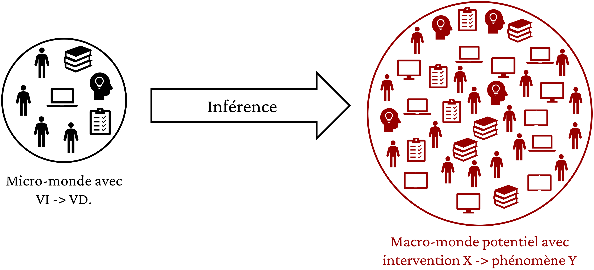{width="80%"}

Pour faire ce passage du *micro-* au *macro-monde* on peut distinguer deux types d'inférences qui, encore une fois, s'influencent mutuellement, mais qu'il faut bien faire attention à ne pas confondre [@meehlAppraisingAmendingTheories1990; @yarkoniGeneralizabilityCrisis2022; @shadishExperimentalQuasiexperimentalDesigns2002]:

-   L'inférence statistique

-   L'inférence *pratique*

## Inférence statistique

L'inférence statistique sert à évaluer l'adéquation entre les données générées par le *micro-monde* et les attentes opérationnelles des chercheurs. Le plus ces attentes ont été explicitées de manière claire et précise -- par exemple à travers une hypothèse directionnelle $\mathbb{P}({VD}\space|\space{X_1}) > \mathbb{P}({VD}\space|\space{X_0})$ -- le plus l'inférence statistique peut contribuer à évaluer la validité interne de la manipulation expérimentale.

L'inférence statistique dépend étroitement de l'approche statistique envisagée par les chercheurs. Néanmoins, indépendamment de ce choix, il faut bien considérer que l'inférence statistique:

-   Est fondée sur des modèles et théories mathématiques qui sont de quelque sorte indépendantes de la spécificité de l'expérience elle-même. Par exemple, on peut avoir un même test statistique pour une VD qui mesure le sentiment d'auto-efficacité d'une étudiant-e et pour une VD qui mesure le temps de réaction avant de cliquer sur un bouton dans une interface logiciel.

-   Est étroitement liée à la philosophie/approche épistémologique qui est consacrée au rapport entre probabilité et connaissance/réalité. Les deux philosophies plus répandue à présent -- l'approche fréquentiste [@lakensPracticalAlternativeValue2021; @nickersonNullHypothesisSignificance2000] et l'approche Bayésienne [@mcelreathStatisticalRethinkingBayesian2020; @wagenmakersBayesianInferencePsychology2018a; @wagenmakersBayesianInferencePsychology2018; @matzkeBayesianInferencePsychology2018; @rouderBayesianInferencePsychology2018] -- utilisent des postulats et confèrent aux résultats statistiques des interprétations différentes.

-   Est limitée au *micro-monde* de la relation entre VI et VD. La représentativité de l'intervention de la part de la VI et/ou du phénomène d'intérêt de la part de la VD ne peuvent pas être confirmée/infirmée par le résultat d'une analyse inférentielle.

## Inférence *pratique*

L'inférence pratique, au contraire, concerne le rapport avec le *macro-monde*. Elle détermine à quel point l'expérience permet (ou pas) de contribuer à répondre à la question de recherche, par exemple à travers la corroboration ou le rejet des hypothèses théoriques. Ce type d'inférence est plus articulée et moins *mécanique* de l'inférence statistique [@meehlAppraisingAmendingTheories1990; @scheelWhyHypothesisTesters2021; @mayoStatisticalInferenceSevere2018]. En effet, l'inférence pratique:

-   Est fondée sur les connaissances du domaine de recherche spécifique. L'intermédiation des chercheurs dans l'analyse des résultats est toujours nécessaires, indépendamment des résultats statistiques obtenus.

-   Utilise l'inférence statistique pour aider l'interprétation, mais reste critique vis-à-vis de celle-ci, en identifiant par exemple des limitations ou des explications alternatives aux résultats statistiques obtenus.

-   Vise le *macro-monde*, mais est en même temps contrainte par les spécificités de l'opérationalisation du *micro-monde*.

-   S'adresse de manière plus large, si possible et jugée adéquat par les chercheurs, à la question de recherche et aux éventuels mécanismes causaux postulés par les hypothèses théoriques.

# Apports et limites de la méthode expérimentale

Cette section propose une brève et incomplète analyse critique des avantages et limites de la méthode expérimentale.

## Délimiter l'effet d'intérêt et limiter les biais potentiels

L'intervention active en forme de manipulation expérimentale planifiée et opérationnalisée dans le *micro-monde,* combinée à la perspective contre-factuelle de comparer avec un *univers parallèle,* permettent à la méthode expérimentale de délimiter clairement l'effet d'intérêt. Lorsque les VI sont (a) bien décrites, (b) bien différenciées entre elles, et (c) représentatives d'interventions potentielles, la méthode expérimentale permet de quantifier l'efficacité d'une intervention comparée à une autre ou à des autres.

Surtout en combinaison avec l'attribution aléatoire des entités/participant-es aux conditions expérimentales, la délimitation comporte également la réduction de biais ou variables parasites qui pourraient *expliquer autrement* la relation entre l'intervention et l'efficacité sur le phénomène d'intérêt. Ceci concerne également les attentes des chercheurs eux-mêmes. Par exemple, lorsqu'il est possible, il faudrait idéalement que ni les chercheurs, ni les participant-es soient au courant de la condition expérimentale attribuée. En sachant la condition, en effet, les chercheurs pourraient -- volontairement ou inconsciemment -- guider les participant-es vers une meilleure performance dans la condition qui reflète l'hypothèse opérationnelle et, par extension, corrobore les attentes théoriques/causales de la recherche.

De plus, une utilisation attentive et avertie de l'inférence statistique avec la méthode expérimentale peut contribuer à *néutraliser* la prédisposition des êtres humains à déceler un ordre dans un pattern qui en réalité n'est que du bruit. Le recours à la précision et démontrabilité mathématique des probabilités peut augmenter les chances de construire un corpus d'évidences partagées au sein de la communauté scientifique.

## Toutes choses *n'étant jamais* égales par ailleurs

En même temps, même si la méthode expérimentale permet de limiter des biais potentiels, il est impossible de construire un univers parallèle dans lequel *toutes choses étant égales par ailleurs*, sauf en ce qui concerne la manipulation expérimentale. Ceci est déjà valable dans le *micro-monde*, dans lequel la randomisation permet de *mieux* *balancer* d'autres variables grâce à une répartition plus équitable entre conditions expérimentales, mais ne garantit pas l'équivalence absolues si ce n'est à partir d'un large nombre de participant-es.

Par conséquent, la problématique est ultérieurement accentuée dans le *macro-monde*, dans lequel l'attribution aléatoire n'est souvent pas une option. Neutraliser les biais par *diffusion équitable* ne les fait pas disparaître. Dans une démarche explicative, il faudrait pouvoir tenir compte des biais potentiels présents dans le *macro-monde* et les contraster de manière pragmatique, plutôt que de les disperser équitablement. Avec ce processus, il serait également plus simple d'évaluer la capacité des résultats produits dans un environnement plus ou moins contrôlés dans un environnement écologique complexe comme celui dans lequel la technologie éducative est souvent déployée.

## Impossibilité à corroborer ou falsifier *seulement* de manière expérimentale

La méthode expérimentale est souvent prise à exemple comme la méthode phare dans une perspective de corroboration ou de falsification d'une théorie ou d'une hypothèse [@tuncEpistemicPragmaticFunction; @meehlAppraisingAmendingTheories1990; @mayoStatisticalInferenceSevere2018; @maxwell2017]. C'est-à-dire que, grâce à la comparaison systématique entre deux ou plusieurs *univers contre-factuels*, on peut établir à quel point les résultats renforcent ou contredisent des postulats théoriques/causaux. Cette capacité doit néanmoins être pondérée par les nombreuses implications sous-jacentes une expérience avec valence théorique. Par exemple, @meehlAppraisingAmendingTheories1990 propose une formule logique lorsque le test d'une théorie/hypothèse est effectué:

$$
(T/H \cdot A_t \cdot C_p \cdot A_i \cdot C_n) \Longrightarrow (O_1 \subset O_2) 
$$

Dans cette formule:

-   $T/H$ représente la théorie ou l'hypothèse d'intérêt du chercheur dans l'expérience en question

-   $A_t$ représente un set de théories auxiliaires dont l'existence est nécessaire à la théorie/hypothèse en question. Par exemple, on ne peut pas formuler une hypothèse sur l'efficacité d'une technologie éducative par rapport à une autre sur l'apprentissage s'il n'existait pas une ou plusieurs théories qui déterminent que l'apprentissage est possible en premier lieu

-   $C_p$ concerne le *ceteris paribus*, c'est à dire l'équivalent en latin de la formule toutes choses étant égales par ailleurs

-   $A_i$ définit les instruments auxiliaires nécessaire à l'expérience, comme par exemple l'équipement technique ou les instruments de mesure

-   $C_n$ concerne les conditions spécifiques de l'expérience, comme par exemple les participant-es ou la procédure (voir plus bas)

-   $O_1 \subset O_2$ signifie qu'on s'attend à une série d'observations qui sont logiquement liées entre elles, comme c'est le cas des observations dans une expérience qui sont liées par le même micro-monde dans lequel elles ont été générées

Pour établir l'effet de la théorie/hypothèse en question, il faut donc un complexe emboîtement entre différents éléments. Ceci implique que si les observations corroborent la théorie ou l'hypothèse, on ne peut jamais être sûr que cela est vraiment dû à $T/H$. Il se peut que les observations sont en réalité le résultats d'une autre composante sur la gauche de la formule. Le même principe s'applique au rejet d'une théorie ou hypothèse. Même dans ce cas, il n'est pas possible d'établir si le *coupable* est vraiment $T/H$ ou une autre composante. Cette difficulté est notamment l'une des raisons pour lesquelles il existent un large nombre de théorie qui ne sont considérées ni *vraies*, ni *fausses* [@fergusonVastGraveyardUndead2012]. Pour *accepter* ou *réfuter* une théorie ou une hypothèse, il faut en effet l'accord de la communauté scientifique sur plusieurs postulats et considérations auxiliaires. Dans cette perspective, l'utilisation d'un modèle structurel causal en forme de DAG [@pearlCausalInferenceStatistics2016; @pearl2018book; @mcelreathStatisticalRethinkingBayesian2020] et la *fusion* de différentes sources d'informations de manière systématique @bareinboimCausalInferenceDatafusion2016 peuvent contribuer à mieux évaluer $T/H$ .

# Conclusion

Ce document a présenté un survol de la méthode expérimentale appliquée à la technologie éducative organisée en quatre étapes principales. La première étape consiste à justifier une question de recherche d'un point de vue scientifique et éthique qui puisse tirer avantage de la méthode expérimentale. La deuxième concerne la formulation d'un hypothèse théorique qui détermine, de manière causale, la relation entre l'intervention et le phénomène d'intérêt. La troisième prévoit la création d'un *micro-monde* dans lequel les chercheurs *opérationnalisent* les conditions nécessaires et suffisantes pour transformer l'intervention dans une variable indépendante à manipuler et la phénomène d'intérêt dans une variable dépendante à mesurer. Enfin, la quatrième étape, concerne les inférences statistique et pratique qu'on peut tirer du *micro-monde* et l'évaluation critique de si et à quel point ces inférences peuvent s'appliquer au *macro-monde* de la question de recherche et de l'hypothèse théorique.

La maîtrise conceptuelle et technique des tousles aspects inhérent à la méthode expérimentale nécessite au moins de trois types de connaissances:

1.  Les mécanismes propres à la mise en place et l\'exécution d'une expérience
2.  Les potentielles relations causales dans le domaine d'intérêt qui puissent expliquer les effets d'une variable sur une autre
3.  La planification et l'exécution d'analyse statistiques adéquates aux caractéristiques et finalités de la recherche

\markboth{RÉFÉRENCES}{}

# Références {.unnumbered}
