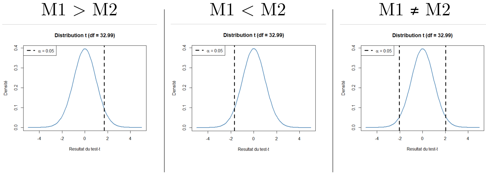

# Solution aux questions dans le workshop

Ce document propose les réponses aux questions proposées dans le README.md du workshop.

## 01 Modélisation de base

**Quelle est la différence entre la moyenne et la médiane ?**\
Il s'agit de deux modélisation de données de type *tendance centrale*, c'est-à-dire qui essaient de représenter un échantillon à travers un indice qui maximise le *groupement* des données. La moyenne est calculée sur la base de la somme des mesures divisée par le nombre d'observations/items :

-   *M*{1, 2, 3, 4, 10} = (1 + 2 + 3 + 4 + 10) / 5 = 4

La médiane dispose chaque mesure en ordre croissant et s'intéresse à l'observation qui se trouve exactement au milieu de la liste, ou entre la moyenne des deux observations qui se trouve au centre si N est multiple de 2 :

-   *Md*{1, 2, 3, 4, 10} = 1, 2, 3, 4, 10 = 3 (i.e. le troisième chiffre a deux chiffre sur la droite et deux sur la gauche)

En général, la moyenne est plus sensible aux valeurs extrêmes comparé à la médiane.

**Plus l'écart entre données est grande, plus la variance est \_\_\_\_\_\_ ?**\
Grande. La variance est la somme de la différence entre chaque observation et la moyenne de l'échantillon au carré. L'utilisation de la puissance au carré a deux conséquences importantes :

1.  Toutes les différences deviennent positives et donc des valeurs supérieures à la moyenne ne s'annulent pas avec des valeurs inférieurs à la moyenne

2.  La puissance au carré donne plus de poids aux valeurs extrêmes : une différence de 2 unités par rapport à la moyenne a un poids de 4 unités de variance, tandis qu'une différence de 3 unités a un poids de 9 unités de variance.

**Quel est le rapport entre la variance et l'écart type ?**\
L'écart type est la racine carrée de la variance. Ceci permet de re-transformer l'écart type dans la même unité de la mesure (e.g. en seconds). Contrairement à la moyenne ou médiane qui sont des mesures de tendance centrale, l'écart type mesure la dispersion des données dans un échantillon : le plus l'écart type est élevé, le plus les données sont *disséminées*/hétérogènes.

## 02 Simulations des données et randomisation

**Si on utilise une attribution totalement aléatoire, les trois groupes/modalités auront toujours le même nombre de participant-es ?**\
Non. Une randomisation totale signifie que chaque groupe/modalité a à chaque tirage exactement les mêmes chances d'être attribué. Par conséquent, nous n'avons aucune garantie que chaque groupe/modalité ait le même nombre d'observations. Pour ce faire, il faut utiliser des mécanismes qui balancent les observations. Vous pouvez adapter ce simple script et le lancer dans RStudio pour obtenir une assignation aléatoire mais balancée des participant-es.

    library(tidyverse)

    n_participants = 48
    participants_code = paste0("P", 1:n_participants)
    vi_conditions = c("Groupe A", "Groupe B", "Groupe C")

    if(n_participants %% length(vi_conditions) == 0) {
      random_assignment = tibble(
        vi_conditions = rep(vi_conditions, (n_participants/length(vi_conditions)))
      ) |>
        transmute(
          order = row_number(),
          participant = paste0("P", order),
          groupe = sample(vi_conditions, n_participants, replace = FALSE),
        ) |>
        arrange(order)
      View(random_assignment)
    } else {
      print("Le nombre de participant-es doit être un multiple du nombre de conditions dans la vi_conditions.")
    }

**Quelles mesures sont plus similaires/différentes dans les trois groupes ? Est-ce qu'il y a un rapport entre la distribution depuis laquelle les données sont tirées et la similarité des moyennes/écarts types ?**\
C'est difficile à dire depuis les données car elles ne sont pas sur la même échelle. Il faut se méfier des analyses *à l'œil nu.* Il faudrait à la rigueur transformer les données dans une échelle comparable, par exemple en les standardisant (les transformer dans une moyenne de 0 et un écart type de 1). D'un point de vue logique, des données uniformes sont potentiellement plus éloignés car toutes ont la même fréquence potentielle. Les distributions normales et exponentielles, au contraire, présentent des *sommets*, ce qui augmente la probabilité d'avoir des données plus proches.

**Plus grand le nombre de participant-es, plus \_\_\_\_\_\_\_\_\_ les différences entre moyennes et écarts types.**\
Petite. En augmentant les observations on diminue le poids d'éventuels valeurs extrêmes. Par conséquent, les données sont moins exposées à des fluctuations due simplement à l'effet d'échantillonnage.

**Qu'est-ce que vous en concluez sur la possibilité d'avoir des potentiels facteurs indépendants de la VI qui pourraient influencer la VD (pas présente dans ce jeu de données) ?**\
On peut voir par exemple qu'avec les données de base du script, l'âge moyen du groupe B est inférieur de plus de 10 ans des groupes A et C. Si nous avions choisi une VD sensible à l'âge (e.g. vitesse de traitement, expérience préalable dans un domaine, ...) nos résultats pourrait montrer des différences dans les groupes qui est déterminée par les effets de fluctuation de l'âge dans l'échantillon plutôt que à l'intervention.

| groupe |   N | M_age | SD_age | M_fatigue | SD_fatigue |   M_qi | SD_qi |
|:-------|----:|------:|-------:|----------:|-----------:|-------:|------:|
| A      |   9 | 47.27 |  15.46 |      0.66 |       0.53 | 106.29 | 16.93 |
| B      |   9 | 35.52 |  13.04 |      0.71 |       0.46 |  98.16 | 19.17 |
| C      |  12 | 48.99 |  13.00 |      1.32 |       2.03 | 104.21 |  9.09 |

**Imaginez deux phénomènes en relation avec les technologies éducatives dans le MALTT (e.g. compétences techniques, intérêt pour les technologies, ...). Comment pensez-vous que ce phénomène est/serait distribué chez l'ensemble des apprenant-es (passé-es et futures) du MALTT ?**\
C'est la difficulté de raisonner en termes de distribution/mesure des phénomènes. Il faut une connaissance du domaine pour imaginer comment un phénomène peut se distribuer, ou de données pour l'établir empiriquement. On peut soupçonner que les compétences techniques suivent une distribution exponentielle (pas mal sans connaissances techniques, la plupart seulement avec quelques connaissances, et ensuite une diminution progressive jusqu'à ce qui en ont beaucoup).

## 03 Échantillonnage

**Est-ce que les distributions des moyennes et écarts types sont différentes ou similaires en fonction de la distribution *mère* depuis laquelle les échantillons sont tirés ?**\
Elles sont similaires indépendamment de la distribution *mère*, que ce soit pour les moyennes ou les écarts types.

**Est-ce que les distributions obtenues ont des formes reconnaissables ? Si oui, avec quel type de distribution on peut les identifier ?**\
Oui, toutes les distributions s'approchent d'une distribution normale/gaussienne.

**Qu'est-ce que vous pouvez en conclure ?**\
Lorsqu'on a à faire avec des échantillons et non pas des *populations* entières, les échantillons sont normalement distribués. Il faut bien comprendre qu'il s'agit de distribution d'échantillons et non pas de distributions de données. Chaque distribution représente la fréquence des moyennes (ou écarts types) d'échantillons différents. Ce principe s'applique aussi par exemple aux différences entre moyennes dans deux groupes/échantillons. Ce code R simule de tirer deux groupes/échantillons de 100 observations depuis une distribution normale M = 100, SD = 15. Si on ne retient que la différence entre les deux moyennes et on affiche la distribution des 1000 moyennes, on obtient une distribution normale. En d'autres termes, le fait qu'il y a une différence de 0 entre les deux est l'outcome la plus probable/plausible.

    # Simuler la différence entre deux groupes tirés de la même distribution normale
    difference = replicate(1000, {
      groupe1 = rnorm(100, 100, 15)
      groupe2 = rnorm(100, 100, 15)
      groupe2 - groupe1
    })
    plot(density(difference))

## 04 Puissance statistique pour un test *t* de Welch

**Combien de participant-es seraient nécessaire pour détecter un SESOI de Cohen's d = 0.5, dans un test bilatéral (alternative = "two.sided") avec un erreur de type I de 0.05 et de type II de 0.8 ?**\
64 par groupe, donc 128 au total.

**Modifiez seulement l'alternative = "greater" à la ligne 25 et laissez tous les autres éléments inchangés. Qu'est-ce que vous observez au niveau du nombre de participant-es nécessaires ? Est-ce que vous imaginez qu'avec l'alternative "less" le nombre sera différent ? (Hint : si vous voulez tester il faudra mettre le SESOI négatif, à -0.5)**\
Avec un test unilatéral il faut 51 participants par groupe, donc 102 au total, que ce soit dans l'alternative M1 \> M2 ou M1 \< M2. Il s'agit donc d'un nombre considérablement inférieur par rapport à l'alternative bilatéral. Cela s'explique par le fait que la zone de la distribution nulle couverte par le 5 de l'erreur de type I est toute sur l'une des deux côtés de la distribution t. De cette manière, il faut donc une valeur du test t moins extrême pour franchir le seuil, ce qu'on peut obtenir avec un nombre de participant-es moins élevé. L'image ci-dessous montre que pour un test unilatéral, le seuil correspondant à une p-valeur de 0.05 est supérieur à -2 ou inférieur +2. En d'autres termes, ces seuils sont plus proche du sommet de la courbe où la densité est plus élevé et donc un résultat plus probable/plausible. Au contraire, pour le test bilatéral il faut un résultat du t test inférieur à -2 ou supérieur à +2, donc plutôt vers les extrémités de la courbe où la densité est plus faible.

**Remettez l'alternative = "two.sided". Dans la première manipulation avec type I = 0.05, type II = 0.8, et SESOI = 0.5 vous avez obtenu 64 participant-es par groupe. Diminuez maintenant le SESOI = 0.25, la taille de l'échantillon nécessaire et plus grande ou plus petite ? De ce fait, vous pouvez conclure que plus \_\_\_\_\_\_\_\_ est le SESOI, plus \_\_\_\_\_\_\_\_\_\_ sera l'échantillon nécessaire. Essayez d'expliquer ce phénomène.**\
Plus grand le SESOI, plus petit l'échantillon nécessaire. Ou respectivement plus petit le SESOI, plus grand l'échantillon nécessaire. Cela s'explique par le fait qu'un grand effet, par exemple une grande différence entre deux groupes, est plus évidente et nécessite donc de moins d'observations pour la déceler. Au contraire, une petite différence est plus sensible à du *bruit* et nécessite donc plus d'observations avant de pouvoir détecter le signal.

Avec à nouveau le SESOI = 0.5.

**Augmentez d'abord le type I à 0.15, quelle variation observez vous sur la taille de l'échantillon nécessaire ? Puis diminuez le type I à 0.01, quelle variation observez vous maintenant ?**\
Avec alpha = 0.15, il faut 2x43 participants. Avec alpha 0.01, il faut 2x96 participants.

**Remettez le type I à 0.05 et augmentez le type II à 0.95, quelle variation observez vous sur la taille de l'échantillon nécessaire ? Diminuez maintenant le type II à 0.6, quelle variation observez vous ?**\
Avec 1-beta = 0.95, il faut 2x105 participants. Avec 1-beta = 0.6, il faut 2x41 participants.

**Sur la base de ces changements, la variation de quel type d'erreur influence davantage la taille de l'échantillon ?**\
L'erreur de type II a généralement plus d'impact sur la taille de l'échantillon et cela en dépit du fait qu'on a la tendance plutôt à se focaliser sur l'erreur de type I. Quelle erreur est plus importante dépend néanmoins du domaine/contexte dans lequel on se trouve. Est-il plus grave de penser qu'un effet existe lorsqu'en réalité il n'existe pas ? Ou de rater un effet qui existe en pensant qu'il n'existe pas ?

## 05 Effectuer une comparaison entre deux moyennes/groupes

**Exécutez progressivement les différentes parties du script avec les paramètres initiaux (M1 = 100, SD1 = 15, M2 = 115, SD2 = 15, Ngroupe = 20) et essayez de répondre aux questions suivantes :**

-   **Quel type d'hypothèse est testée dans ce script ?**\
    M(groupe A) ≠ M(groupe B), ce qui équivaut à une hypothèse non-directionnelle ou bilatérale. En d'autres termes, on s'attend à ce que les deux groupes diffèrent dans l'*efficacité* de la VD, mais sans établir à priori quel groupe aura une *meilleure* *efficacité.*

-   **À quoi correspond donc l'hypothèse nulle ?**\
    L'hypothèse nulle consiste à partir du présupposé qu'il n'y a pas de différence entre les deux moyennes/groupes. En d'autres termes, que l'effet défini par la différence entre les deux moyennes est égale à 0 (M1 - M2 = 0).

-   **Identifiez les résultats du test correspondants respectivement aux degrés de liberté, au résultat du t test statistique, à la p-valeur obtenue, la taille de l'effet brute et standardisée avec les intervalles de confiances à 95%.**

    -   Degrés de liberté : df = 32.99

    -   t(32.99) = -3.14

    -   p-valeur = 0.004

    -   Taille de l'effet brute : différence = -13.46, 95% CI [-22.19, -4.74], ce qui correspond notamment à la soustraction entre la moyenne du groupe A et la moyenne du groupe B (96.20 - 109.66 = -13.46)

    -   Taille de l'effet standardisée : Cohen's d = -1.09, 95% CI [-1.82, -0.35]

-   **L'hypothèse nulle (H0) est \_\_\_\_\_ ? L'hypothèse alternative (H1) est \_\_\_\_\_\_ ?**\
    H0 est rejetée, H1 est donc acceptée/corroborée. En d'autres termes, il y a une probabilité de seulement 0.004 (ou 0.4%) d'observer des données similaires ou encore plus incompatibles avec la distribution nulle. De ce fait, le chercheur prend le risque de rejeter l'hypothèse M1 = M2 et favoriser l'hypothèse alternative selon laquelle les deux moyennes sont différentes. Par conséquent, il faut conclure en termes expérimentaux que ce qui a été observé dans le macro-monde en termes de VI-VD peut s'appliquer au macro-monde en termes d'intervention-phénomène d'intérêt. Comme indiqué en cours selon l'approche Neyman-Pearson, le chercheur ne peut néanmoins pas savoir si cela correspond ou pas à la *vérité*.

-   **Quelle interprétation donneriez-vous de ces résultats ?**\
    L'intervention produit un effet qui peut se quantifier comme une différence d'environ 13.5 unités de la VD en faveur du groupe B. Les intervalles de confiance indiquent cependant que l'incertitude autour de cet effet est encore plutôt large.

**Laissez tous les paramètres inchangés et modifiez le type de test de alternative = "two.sided" à alternative = "less" à la ligne 65. Quelle interprétation donnez-vous maintenant par rapport à H0 et H1 ? Regardez ensuite les indicateurs et comparez-le avec le test précédent. La p-valeur est plus \_\_\_\_\_ ? Pourquoi ? La taille de l'effet est \_\_\_\_\_\_ ? Pourquoi ? Qu'est qui apparaît maintenant dans les intervalles de confiance ? Pourquoi ?**

-   Même conclusion du test précédent : H0 est rejetée et H1 est acceptée/corroborée. Il faut néanmoins faire attention que si l'hypothèse alternative est M1 \< M2, l'hypothèse nulle devient M1 \>= M2. Traduit en termes d'effet, cela devient donc M1 - M2 \>= 0.

-   La p-valeur est plus petite, elle passe de 0.004 à 0.002. Comme indiqué dans la partie sur la puissance statistique, cela s'explique par le fait que le seuil critique de l'erreur de type I est *moins* extrême car il est tout sur le côté gauche de la distribution nulle.

-   La taille de l'effet reste inchangée dans l'estimation (différence = -13.46). La taille de l'effet est indépendante de la direction de l'hypothèse, ce qui renforce ultérierment le principe selon lequel la p-valeur ne donne aucune informations sur les conséquences *pratiques*/quantifiables de l'effet. La p-valeur détermine seulement le choix de rejeter/accepter H0/H1.

-   La limite inférieur des intervalles de confiance est à ce moment -Inf, ce qui équivaut à moins infini en termes mathématiques. En termes concrètes, vue qu'on s'intéresse seulement à savoir si M1 \< M2, nous sommes intéressé-es exclusivement à la limite supérieur de l'intervalle de confiance : elle doit être \< 0. Ce qui est le cas ici, vue que la limite supérieur est -6.2. À noter que ce chiffre est inférieur à -4.74 du test bilatéral pour les mêmes raisons de *risque* vers une direction. On s'expose plus sur l'un de côté.

**Enfin, modifiez l'alternative = "greater" et répondez aux mêmes questions.**

-   L'hypothèse alternative est maintenant M1 \> M2, avec l'hypothèse nulle M1 \<= M2 (ou M1 - M2 \<= 0). On sait déjà depuis les résultats précédent que M1 - M2 = -13.46. Donc l'hypothèse nulle n'est pas rejetée.

-   La p-valeur est beaucoup plus élevée, elle devient p = 0.998, c'est-à-dire à l'opposé de p = .002 (1 - 0.002 = 0.998). Cela s'explique par le fait que le seuil alpha se trouve de l'autre côté (vers +2) de la distribution nulle par rapport au résultat du t test obtenu (-3.14). Souvenez-vous que la p-valeur est un indicateur de (in)compatibilité avec la distribution nulle : une p-valeur proche de 0 témoigne que les données tendent vers l'incompatibilité avec la distribution nulle ; une valeur proche de 1 témoigne que les données tendent plutôt vers la compatibilité avec la distribution nulle. Ici on est clairement dans une condition ou l'hypothèse nulle est plutôt compatible avec les données observées, car les données montrent clairement que M1 \< M2. Vous voyez ici l'importance de pré-enregistrer les hypothèses, car cette situation est un exemple des tentations que peuvent avoir les chercheurs. Si l'hypothèse du chercher M1 \> M2 n'avait pas été figée en amont dans la fiche, les chercheurs pourraient maintenir ces mêmes données est simplement changer la direction de leur hypothèse en M1 \< M2. À ce moment, ils se retrouvent avec un résultat statistiquement significatif !

-   La taille de l'effet reste encore une fois inchangée : la différence entre moyenne est toujours de -13.46. À ce moment le limite supérieur de l'intervalle de confiance passe à +Inf car nous nous intéressons plutôt à la limite inférieur.

**Mettez à nouveau l'alternative = "two.sided" et utilisez maintenant les paramètres suivants M1 = 100, SD1 = 15 et M2 = 102, SD2 = 15, ce qui signifie qu'il y a dans le macro-monde une petite différence de 2 points entre les deux moyennes. Utilisez `n_participants_per_groupe = 1000`, donc avec beaucoup de participants pour chaque groupe. Menez le test et observez le résultat. Qu'est-ce que vous pouvez conclure depuis cette simulation ?**\
D'un point de vue mathématique, il est garanti qu'une différence entre deux moyennes à un certain moment devienne *statistiquement* significative, mais cela ne signifie pas qu'elle est *pratiquement* digne de note. Ici nous ne savons pas à quoi correspondent les deux unités de différence entre 100 et 102. C'est la connaissance du domaine qui nous permet de définir/discuter l'effet de l'intervention en termes pratiques ou théoriques.

**Testez plusieurs combinaisons entre paramètres, par exemple en augmentant ou diminuant la différence entre les deux moyennes, en explicitant des écarts types plus grands/petits ou hétérogènes entre les deux groupes. Modifiez aussi le nombre de participants par groupe. Notez si vous pensez trouver des *pattern* qui se manifestent (e.g. si j'augmente \_\_\_\_ alors \_\_\_\_\_\_).**\
En règle générale vous maximiser la chance de pouvoir détecter un effet, c'est-à-dire une différence *statistiquement* significative entre les deux moyennes, si :

-   La différence entre les deux moyennes est grande

-   L'écart type est petit et similaire pour les deux groupes

-   Vous augmentez le nombre d'observations/participant-es

## 06 Simuler plusieurs comparaisons entre moyennes/groupes tirés du même macro-monde

**Laissez les valeurs indiquées dans le fichier original (M1 = 100, SD1 = 15 ; M2 = 115, SD2 = 15 ; N = 20) et faites les 1'000 simulations. Depuis le graphique que vous obtenez, essayez de mettre en perspective les résultats :**

-   **Comment expliquez-vous que *seulement* 86.2% des tests donnent une *p*-valeur \< 0.05 ?**\
    À cause de la variabilité dans l'échantillonnage, dans 13.8% des échantillons les deux groupes ont des données qui ne sont suffisamment pas divergentes pour reproduire l'effet qui existe dans le macro-monde.

-   **Le 13.8% des *p*-valeurs \> 0.05 correspondent à quel type de phénomène dans un test d'hypothèse basé sur un modèle *nul* ?**\
    Il s'agit de tests qui appartiennent à l'outcome Erreur de type II dans le test d'une hypothèse : on commet l'erreur de ne pas rejeter l'hypothèse nulle, lorsqu'en réalité il faudra la rejeter, car il existe dans la réalité/macro-monde un effet de l'intervention.

**Laissez les valeurs du macro-monde courants et augmentez le nombre de participants de 20 à 30. Lancez la simulation. Combien des *p*-valeurs \< 0.05 observez à ce moment ? Quelle conclusion pouvez-vous en tirer ?**\
Le pourcentage augmente à 96.4%. Avec plus d'observations/participant-es, on diminue le risque d'avoir des erreurs de type II.

**Modifiez à ce point les caractéristiques du macro-monde pour avoir exactement les mêmes valeurs dans les deux groupes : M1 = M2 = 100 ; SD1 = SD2 = 15. Laissez 30 participants par groupe et lancez la simulation. Sur la base du résultat, vous pouvez conclure que : quand il n'y a pas d'effet dans le macro-monde, la distribution des *p*-valeurs est \_\_\_\_\_\_\_\_\_\_. Quelles sont à votre avis les implications de ce fait, notamment en relation avec la problématique de la replicabilité des résultats en sciences sociales ?**\
Lorsqu'il n'y a pas d'effet dans le macro-monde, la distribution des p-valeurs s'approche d'une distribution normale. En d'autres termes, le test a plus ou moins les mêmes probabilités de donner toutes les p-valeurs possibles, y compris une p-valeur qui est *significative*. Dans ce cas, il s'agirait d'un erreur de type I.

Le problème avec une seule expérience/un seul test est que nous n'avons pas les moyens de savoir si une p-valeur \< alpha (e.g. 0.05) est l'*exception* d'une distribution uniforme (un faux positif ou erreur de type I), ou c'est la *normalité* d'une distribution qui favorise des p-valeurs plus proche de 0. Pour cette raison, on essaie de répliquer les expériences ou mener des méta-analyses pour corroborer les résultats. Si déjà deux expériences menées par deux équipes indépendantes dans les mêmes conditions présentent des tests statistiquement significatifs, alors on peut être beaucoup plus rassuré-es qu'il ne s'agit pas d'une erreur de type I.

## 07 Équivalence entre deux moyennes/groupes

Aucune réponse spécifique. Les tests d'équivalence sont assez récents et donc ne sont pas fréquents dans la littérature. En général, on a besoin de beaucoup d'observations/participant-es pour déterminer l'équivalence d'un t test, surtout si on vise une petite intervalle autour de 0.

## 08 Puissance statistique pour une ANOVA simple

**En utilisant les paramètres de base k = 3, alpha = 0.05 et puissance 0.8, combien d'entités/participant-es sont nécessaires par groupes avec un SESOI de Cohen's f = 0.25 ?**\
53 participant-es x 3 groupes, c'est-à-dire 159 au total.

**Modifiez le paramètre k = 5 pour augmenter le nombre de modalités de la VI en laissant les autres paramètres pareils. Quelle est la nouvelle valeur de N ? Essayez d'expliquer ce mécanisme.**\
40 participant-es x 5 groupes, c'est-à-dire 200 au total. En proportion, il faut moins de participant-es par groupes comparé à une ANOVA avec 3 groupes. Cela s'explique par le fait qu'une ANOVA simple test si au moins deux moyennes/groupes sont différents, ce qui est plus probable si on a 5 plutôt que *seulement* 3 groupes. En revanche, effectuer des ANOVA avec plusieurs groupes est assez rare en méthode expérimentale, car même si en proportion moins de participant-es sont nécessaires, le nombre total devient rapidement assez conséquent en termes de temps et éventuellement de budget.

## 09 Effectuer une comparaison entre trois moyennes/groupes (ou plus)

**En laissant les données disponibles de base dans le fichier, observez les différentes représentations textuelles et graphiques et essayez de repérer toutes les informations importantes. Quel est le résultat du *omnibus* test ? Quels sont les résultats des comparaisons ? Concentrez-vous ensuite sur les postulats : sont-ils respectés à votre avis ?**\
Le résultat du omnibus test est contenu dans le tableau de l'ANOVA qu'on reporte souvent dans des contributions scientifiques car il contient toutes les informations utiles (degrés de liberté, résultat du test statistique, p-valeur et taille de l'effet standardisé). Au niveau de la taille de l'effet, il serait idéalement mieux d'y ajouter aussi les intervalles de confiance à 95% :

| Effect | df     | MSE    | F     | ges               | p.value |
|:-------|:-------|:-------|:------|:------------------|:--------|
| groupe | 2, 147 | 220.91 | 80.94 | .524 [0.43, 1.00] | \<.001  |

Dans le tableau sont contenus les informations suivantes :

-   La première colonne identifie la VI, elle peut donc s'appeler en fonction du plan expérimentale.

-   La deuxième colonne illustre les deux types de degrés de liberté (df). Le 2 consiste dans les df de l'intervention qui sont estimés à travers les groupes selon la formule *k - 1*, où *k* représente le nombre de groupes. Dans cette ANOVA nous en avons 3, donc les df sont 3 - 1 = 2. Le 147 consiste dans les df résiduelles, c'est-à-dire liés au nombre d'observations selon la formule *N - k*, où *N* est le nombre d'observations (150 ici) et *k* encore une fois le nombre de groupes (donc 150 - 3). Comme indiqué dans le cours, la compréhension des degrés de liberté est plutôt complexe. Les plus ambitieux-euses peuvent lire l'article de Rodgers (2019) qui utilise un métaphore économique assez compréhensible.

-   La troisième colonne illustre la moyenne de l'erreur standard (Mean Standard Error). Il s'agit d'une mesure de variabilité à l'intérieur du groupe qui est utilisé dans le test statistique. Comme pour les df, il s'agit d'éléments techniques qui ne sont pas traités dans ce cours.

-   La quatrième colonne reporte le résultat du test statistique en termes de la valeur F. L'interprétation naïve de F est que le plus il s'éloigne de 1, le plus les données observées sont incompatible avec l'hypothèse nulle que toutes les moyennes sont égales.

-   La cinquième colonne illustre la taille de l'effet standardisée. Il existe différentes taille de l'effet pour les tests statistiques. Ici le Generalized Effect Size est utilisé. En général, pour l'ANOVA simple on utilise souvent l'éta carré ou l'éta carré partiel, mais dans ce spécifique il n'y a pas de différence car dans l'ANOVA simple les trois tailles de l'effet sont exactement les mêmes. On peut calcuer les intervalles de confiance autour de la taille de l'effet pour donner une idée de l'incertitude : plus l'intervalle est large, plus la mesure est incertaine.

-   La sixième colonne illustre enfin la p-valeur, c'est-à-dire la probabilité d'obtenir des données autant ou encore plus incompatibles avec le modèle nul sous-jacent, c'est-à-dire celui basé sur le principe qu'il n'y a pas d'effet/différence entre les moyennes. Selon le seuil alpha choisi en amont pour le test, on peut rejeter l'hypothèse nulle et favoriser l'hyothèse alternative si p-valeur \< alpha (e.g. 0.05)

L'ANOVA simple indique si au moins deux moyennes sont différentes, mais ne nous dit pas lesquelles. Les comparaisons/contrastes multiples nous permettent de se focaliser sur les différences entre groupes :

| contrast | estimate |    SE |  df | t.ratio |  p.value |
|:---------|---------:|------:|----:|--------:|---------:|
| A - B    |  -18.887 | 2.973 | 147 |  -6.354 | \< 0.001 |
| A - C    |  -37.820 | 2.973 | 147 | -12.723 | \< 0.001 |
| B - C    |  -18.933 | 2.973 | 147 |  -6.369 | \< 0.001 |

Les comparaisons indiquent que les trois moyennes sont différentes les unes des autres. La colonne estimate corresponde à la soustraction entre la moyenne du premier groupe et la moyenne du deuxième groupe (e.g. moyenne groupe A - moyenne groupe B pour la première ligne). Donc on peut voir que entre le groupe A et le groupe B il y a -18.9 unités de VD de différence, c'est-à-dire que le groupe B a obtenu une moyenne supérieur de 18.9 unités de la VD.

Enfin, les graphiques des postulats montre que le test respecte les caractéristiques attendues pour que la modélisation de l'ANOVA puisse être utilisée dans le contexte d'un test d'hypothèse.

**Modifiez les paramètres pour le groupe C afin qu'il ait la même moyenne (M = 115) et écart type (SD = 15) du groupe B. Vous avez donc le groupe A qui est tiré d'un macro-monde avec une moyenne inférieure aux groupes B et C, qui au contraire sont tirés du *même* macro-monde. Quel est l'effet sur le *generalised effect size* ? Que se passe-t-il au niveau des comparaisons ?**\
La taille de l'effet diminue à 0.31 [0.21, 1.00], tandis que maintenant seulement deux comparaisons/moyennes sur trois sont différentes (A vs. B, et A vs. C), tandis que la comparaison entre B et C n'atteigne pas le seuil alpha.

## 10 Effectuer une ANOVA avec une autre variable (ANCOVA)

**Effectuez d'abord le test avec les données disponibles dans le script et essayé d'interpréter les résultats, notamment en fonction au tableau de l'ANOVA *simple* du point précédent**\
Contrairement à l'ANOVA simple du point précédent, nous avons ici deux variables qui servent à modéliser la VD : la VI (groupe A, B ou C) et une autre variable continue appelée de manière générique *z.* Par conséquent, chaque observation consiste dans l'attribution au groupe expérimentale, plus la mesure de la VD, plus la mesure de cette variable *z*. Ce que le test souvent appelé ANCOVA fait est de tester l'*apport* de la VI et de l'autre variable dans l'explication/modélisation de la VD. Ce qu'il faut comprendre est que pour les chercherus, la VI a un statut particulier, car c'est ce qu'on manipule, mais pour le modèle statistique la VI et la variable *z* sont *simplement* deux variables qui participent au modèle. Ce qui est très puissant dans la modélisation linéaire est qu'on peut déterminer l'apport de chaque variable *indépendamment* de l'autre. En d'autres termes, le modèle arrive à projeter la question suivante : si on considère deux observations qui ont la même valeur sur la variable *z,* quel est l'*apport* de la VI ? Il s'agit d'une projection statistique parce que dans la plupart des cas, il n'y aura pas des observations exactement avec la même valeur de *z.* Mais le modèle arrive à *moyenner*/stratifier sur *z* pour obtenir une estimation de VI qui est de quelque sorte *indépendante* de la mesure *z.* On peut le voir dans le tableau de l'ANCOVA obtenu avec le test :

| Effect | df    | MSE   | F      | ges  | p.value |
|:-------|:------|:------|:-------|:-----|:--------|
| groupe | 2, 56 | 73.48 | 2.43   | .080 | .098    |
| z      | 1, 56 | 73.48 | 111.66 | .666 | \<.001  |

Nous avons la mesure de deux variables/effets. L'effet de la variable groupe et celui de la variable *z*. Chaque ligne propose les mêmes indicateurs du tableau du point précédent. On peut noter ici que le test F et le generalized effect size (ges) sont plus élevé pour la varible *z* comparé à la VI groupe. Ceci se traduit par le fait que la p-valeur de la VI \> du seuil alpha de 0.05 (0.098), tandis qu'elle est \< alpha (\<.001) pour *z.* D'un point de vue statistique cela signifie que si on tient compte de l'effet de la variable *z,* alors l'effet de la VI n'est pas statistiquement significatif. D'un point de vue expérimental/causale, on peut traduire le résultat plus ou moins de la manière suivante : la relation entre *z* et la VD est tellement forte qu'elle explique déjà une grande partie de la variance. À ce moment, l'apport de la VI est minimale.

Ce qui est intéressant à tester dans cet exemple est que si vous enlevez de la formule à la ligne 90 la variable *z* du modèle -- formula = mesure \~ groupe + (1\|participant) -- vous obtenez une ANOVA simple dans laquelle à ce moment l'effet de la VI est significatif :

| Effect | df    | MSE    | F            | ges  | p.value |
|:-------|:------|:-------|:-------------|:-----|:--------|
| groupe | 2, 57 | 216.14 | 21.91 \*\*\* | .435 | \<.001  |

Comme indiqué dans la partie du cours sur les fondements expérimentaux, la décision d'inclure la variable *z* dans le modèle ou non doit être faite sur la base de la connaissance du domaine et non pas sur la base du résultat statistique.

**Modifiez le *bruit* de la variable `z` à travers le script. Plus de bruit signifie que la variable z et la VD sont moins en relation l'une avec l'autre. Que se passe-t-il au niveau des résultats lorsque vous augmentez le bruit ? Comment expliqueriez-vous ce résultat ?**\
Si vous diminuez la relation entre *z* et la VD, par exemple en augmentant l'écart type à 50 à la ligne 58, la VI (groupe) devient significative comme c'était le cas si vous enleviez *z.* Ce changement s'explique par le fait que la force de la relation entre la VI et la VD est maintenant plus forte que la relation entre *z* et la VD.

## 11 Puissance statistique d'une ANOVA factorielle

**Laissez les paramètres de base du script et effectuer la simulation de la puissance statistique. Quelle est la puissance statistique pour les différents effets (simples, principaux et interaction) ?**\
Nous avons en général une puissance très élevée, avec 100% pour les effets simples (pairwise comparisons avec t-test), les deux effets principaux (deux première ligne du tableau de l'ANOVA), et 94% pour l'effet d'interaction (troisième ligne du tableau de l'ANOVA).

**Modifiez comme vous voulez les 4 moyennes des conditions expérimentales et menez à nouveau les simulations. Quels patterns pouvez-vous identifier ?**\
De manière général, il est plus difficile d'avoir assez de puissance statistique pour détecter l'interaction comparé aux effets principaux ou simples. Par conséquent, il faut généralement beaucoup plus d'observations/participant-es si on est intéressé-es à un effet d'interaction.

## 12 Effectuer une ANOVA factorielle

**Avec les données de base du script, effectué le test de l'ANOVA et regardez le tableau avec les effets principaux et d'interaction.**

-   **Est-ce que l'effet d'interaction et détecté ou non ? Regardez également le graphique pour vous aider dans la décision.**\
    Oui, l'effet d'interaction est détecté. On peut le voir depuis le tableau de l'ANOVA qui propose les deux effets principaux ainsi que l'effet d'interaction.

    | Effect  | df    | MSE    | F             | ges  | p.value |
    |:--------|:------|:-------|:--------------|:-----|:--------|
    | vi1     | 1, 76 | 191.64 | 187.70 \*\*\* | .712 | \<.001  |
    | vi2     | 1, 76 | 191.64 | 66.14 \*\*\*  | .465 | \<.001  |
    | vi1:vi2 | 1, 76 | 191.64 | 14.31 \*\*\*  | .158 | \<.001  |

    On peut le voir également depuis le graphique de l'ANOVA factorielle : les deux lignes qui connectent les points ne sont pas parallèle. Notamment, on peut voir que l'effet de la VI1 est modéré par la VI2, car le gain entre la condition VI1_sans et VI1_avec est plus élevé (la ligne est plua raide) si on combine la VI1 avec la modalité VI2_forte comparé à la modalité VI2_faible. D'un point de vue conceptuel, cela se traduit par l'affirmation suivante : les apprenant-es bénéficient de la présence d'un dispositif numérique, et ce bénéfice est d'autant plus important si la difficulté de la tâche est forte.

-   **Selon la réponse, menez les comparaisons successives en accord avec le résultat du test de l'interaction.**\
    Compte tenu de la présence de l'interaction, on peut tester les 6 effets simples à travers la comparaison/le contraste entre les 4 conditions expérimentales.

    | contrast                  | estimate |    SE |  df | t.ratio | p.value |
    |:--------------------------|---------:|------:|----:|--------:|--------:|
    | Sans Faible - Avec Faible |  -30.699 | 4.378 |  76 |  -7.013 | \<0.001 |
    | Sans Faible - Sans Forte  |  -13.464 | 4.378 |  76 |  -3.076 |   0.015 |
    | Sans Faible - Avec Forte  |  -67.583 | 4.378 |  76 | -15.438 | \<0.001 |
    | Avec Faible - Sans Forte  |   17.234 | 4.378 |  76 |   3.937 |   0.001 |
    | Avec Faible - Avec Forte  |  -36.885 | 4.378 |  76 |  -8.426 | \<0.001 |
    | Sans Forte - Avec Forte   |  -54.119 | 4.378 |  76 | -12.363 | \<0.001 |

-   **Essayez de comprendre les différents indicateurs et de donner du sens aux résultats. Que signifie-t-il un effet d'interaction dans ce cas ? Qu'est-ce que les comparaisons successives nous disent ?**\
    Comme indiqué au point précédent, un effet d'interaction détermine que l'effet d'une variable peut-être plus ou moins prononcé selon le croisement avec l'autre variable. Les deux effets principaux restent intéressants, mais leur quantification dépende de l'interaction entre les deux VI. Les comparaisons successives entre les quatre modalités suggèrent que toutes les conditions sont différentes les unes des autres, avec des effets aussi large que 68 unités de la VD dans le cas de la comparaisons Sans/Faible vs. Avec/Forte.

**Modifiez les 4 moyennes des conditions expérimentales selon vos choix et essayez de reproduire le même mécanisme du point précédent : tester pour l'interaction et effectuez ensuite les comparaisons correspondantes.**\
Comme il arrive souvent en statistiques, la procédure correcte à effectuer selon la présence ou l'absence de l'interaction peut varier d'article en article. Il peut donc arriver que les effets principaux soient discutés/traités en même temps que l'effet de l'interaction. Ici je présente la procédure qui à mon avis fait le plus de sens d'un point de vue logique, et qui est d'ailleurs supportée par Maxwell et collègues (2017).

**À votre avis, qu'est-ce qu'il faudrait faire dans le cas où il n'y a aucun effet (ni effets principaux, ni interaction) ?**\
Dans ce cas on ne peut rien dire à propos de l'hypothèse qui est testée. Il existe des procédures pour utiliser un test d'équivalence aussi dans le cas d'une ANOVA factorielle, mais elles ne sont pas encore très répandues dans la littérature.
